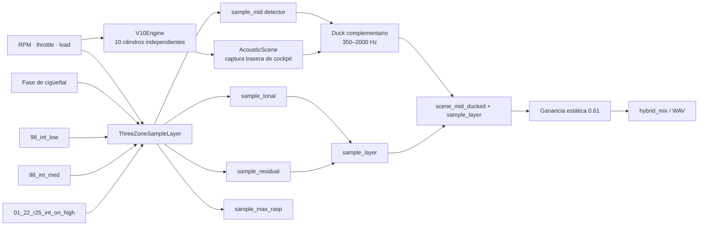
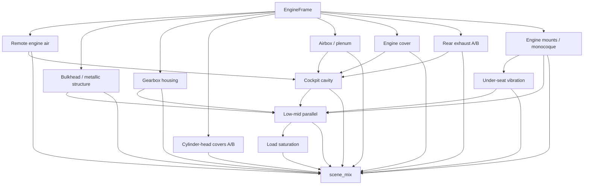

# Arquitectura híbrida de audio V10 Rust — GF509

Este documento es el punto de reanudación canónico para el refinamiento del
audio V10. Describe la ruta que produce `GF509`, partiendo de la base `GF508`
del commit `92ffdd01`. C++ y Faust no participan en este render: la simulación,
la escena acústica, la capa de samples y la mezcla híbrida se ejecutan en Rust.

## Estado validado

- Render: `reports/audio/rust-greenfield/gf509_5000_14500_parameter_corrected_sweep.wav`.
- Perfil: 5000 → 14500 RPM en 7 s, seguido de lift/coast hasta 6500 RPM; 10 s total.
- Sample rate: 44100 Hz; throttle/load: 0.92 / 0.88.
- Pico: 0.9705; clipping: 0%; RMS: 0.1800.
- Tests: 14 aprobados; clippy sin warnings.
- `HYBRID_HEADROOM_GAIN`: 0.61, ajustado después del balance interno.

GF509 aumenta el peso sampleado respecto a GF508 aproximadamente +2.9 dB en
low, +1.9 dB en med y +0.8 dB en max. `max_rasp` queda casi al mismo nivel: el
cambio busca más cuerpo y densidad, no más filo.

## Flujo completo



## 1. Preparación offline

Herramienta: `scripts/audio/prepare_v10_sample_layer.py`.

Por cada fuente crea señal normalizada, stems tonal/residual complementarios,
loops de ciclos completos de 720°, crossfade de costura sin cambiar su duración
mecánica, fase de orden 5 y metadatos JSON con hash SHA-256.

Directorio esperado:
`reports/audio/rust-greenfield/98_sample_layer_prepared`.

| Zona | Archivo | RPM ancla | Origen | Loop efectivo |
|---|---|---:|---|---:|
| low | `98_int_low.wav` | 7499 | explícita | 7496.81 RPM |
| med | `98_int_med.wav` | 8202 | **estimada** | 8195.12 RPM |
| max | `01_22_r25_int_on_high.wav` | 8731.50 | estimada | 8732.07 RPM |

La RPM de `med` no es contractual. Debe reemplazarse con `--rpm
98_int_med.wav=VALOR` si aparece una medición fiable.

La zona `max` usa un loop de 24 ciclos completos de motor (720°), 14545
frames a 44100 Hz (329.82 ms), preparado con `--loop-cycles 24`.
Su crossfade comienza a 8205 RPM y queda completo a 8730 RPM, dentro de las
anclas `med`/`max`; por encima de ahí el runtime lo transpone con las RPM.

## 2. Síntesis física `V10Engine`

Fuentes: `engine.rs`, `crank.rs`, `cylinder.rs`, `acoustics.rs`, `config.rs`.

- ciclo explícito de 720° y diez cilindros;
- diez firmas y headers con longitudes propias;
- colectores compartidos A/B;
- presión directa, derivadas A/B, crankcase, block, head y block/head;
- turbulencia activada por blowdown;
- master seco usado como fuente de escena y stem diagnóstico.

| Parámetro | Valor |
|---|---:|
| firing order | `[0,5,1,6,2,7,3,8,4,9]` |
| combustion rise | 24° |
| expansion decay | 112° |
| exhaust open / ramp / duration | 116° / 5° / 142° |
| cycle variation / cylinder spread | 0.004 / 0.012 |
| exhaust wave speed / reflection | 545 m/s / -0.34 |
| pressure direct / crankcase | 0.07 / 0.025 |
| block / head | 0.56 / 0.48 |
| exhaust / turbulence | 1.55 / 0.40 |
| master | 7.0 |

Deriva GF509:

```text
1 + 0.010·sin(2π·0.83·t) + 0.005·sin(2π·1.17·t + 1.3)
```

GF508 usaba 0.018 / 0.009. Se redujo sin eliminar `cycle_variation`.

## 3. `AcousticScene`

Micrófono virtual: mamparo trasero del cockpit, detrás del asiento.



| Ruta | Gain |
|---|---:|
| dry low / mid / high | 0.45 / 0.18 / 0.12 |
| metal / gearbox / head covers | 1.00 / 0.82 / 0.70 |
| airbox / engine cover / rear exhaust | 0.64 / 0.42 / 0.48 |
| mounts / under-seat / cockpit | 0.12 / 0.09 / 0.16 |
| low-mid parallel / load saturation | 0.14 / 0.10 |
| event residual | 0.055 |

Control de orden 5:

| Ruta | Q | Wet |
|---|---:|---:|
| metal | 3.2 | 0.64 |
| gearbox | 3.0 | 0.48 |
| low-mid parallel | 2.7 | 0.70 |
| head covers | 12.0 | `0.20 + 0.50·high_rpm` |

La redistribución por RPM usa una rampa 8500–14500. Los multiplicadores
exactos están en `scene.rs`; no aplicar EQ global al master.

Deriva estructural GF509:

```text
1 + 0.007·sin(2π·0.79·t + 0.4) + 0.003·sin(2π·1.09·t + 2.1)
```

## 4. `ThreeZoneSampleLayer`

Fuente: `sample_layer.rs`.

- WAV mono PCM16 y JSON schema 1.
- Resampling windowed-sinc de ocho taps.
- Ratio: `(rpm/rpm_ancla)·(source_rate/output_rate)`.
- Alineación inicial de fase de orden 5 con `crank_phase_deg`.
- Cursores siempre activos; el crossfade sólo cambia pesos.

Crossfades:

- bajo 7499: low 100%;
- 7499–8202: low → med, potencia constante;
- 8202–10000: med 100%;
- 10000–13750: med → max, potencia constante;
- cerca de 12000: max dominante;
- desde 13750: max 100%;
- lift/coast recorre la curva en sentido inverso.

Ganancia dependiente de carga:

```text
charge = load·(0.35 + 0.65·throttle)
tonal    = lerp(0.05, 0.22, charge)
residual = lerp(0.12, 0.40, charge)
```

Procesamiento previo al crossfade:

| Zona | Banda | Boost tonal | Boost residual | Post tonal | Post residual |
|---|---:|---:|---:|---:|---:|
| low | 250–900 Hz | +1.0 dB | +4.0 dB | 0 dB | +3.0 dB |
| med | 350–1800 Hz | +1.5 dB | +3.0 dB | +2.5 dB | +3.5 dB |
| max | 500–2500 Hz | +0.75 dB | +2.5 dB | +2.5 dB | +3.0 dB |

Parámetros max:

- `max_rasp`: 1800–6500 Hz, +2.5 dB;
- notch tonal orden 5: Q 10, wet 0.30;
- compresión residual: threshold 0.0275, ratio implícito 2:1;
- ataque/release: 25/120 ms;
- paralelo: 42.5%, makeup de rama 1.25;
- saturación: drive 1.7, mix 27.5%.

Low/med: threshold 0.040, paralelo 30%, drive 1.4, saturación 20%.

## 5. Duck y salida

`sample_mid` controla sólo 350–2000 Hz de `scene_mix`:

| Parámetro | Valor |
|---|---:|
| ataque / release | 20 / 140 ms |
| escala detector | 0.080 |
| reducción máxima | 3.0 dB |

```text
hybrid_mix = (scene_mid_ducked + sample_layer)·0.61
```

No hay limitador híbrido. El headroom estático permite detectar errores.

## 6. Stems

Además de los stems de motor y escena: `scene_mix`, `scene_mid_ducked`,
`sample_tonal`, `sample_residual`, `sample_mid`, `sample_max_rasp`,
`sample_layer` y `hybrid_mix`.

## 7. Comando GF509

```powershell
cargo run --release --manifest-path game/crates/v10-engine-synth/Cargo.toml `
  --bin v10_render -- --rpm 5000 --sweep-end-rpm 14500 `
  --seconds 10 --warmup 1 --accel-seconds 7 --coast-end-rpm 6500 `
  --throttle 0.92 --load 0.88 --sample-rate 44100 --seed 4035964944 `
  --out reports/audio/rust-greenfield/gf509_5000_14500_parameter_corrected_sweep.wav `
  --stems-dir reports/audio/rust-greenfield/gf509_5000_14500_parameter_corrected_sweep_stems `
  --acoustic-scene `
  --sample-layer-dir reports/audio/rust-greenfield/98_sample_layer_prepared
```

## 8. Próxima sesión

1. No aumentar `max_rasp` a ciegas; la aspereza requiere densidad, no más HF.
2. Reanalizar med estacionariamente cuando haya espacio para reportes.
3. Meta intermedia de crest max: 8–9 dB, sin limitador master.
4. Antes de tocar modos, revisar `stem × order`, fase y coherencia.
5. Ajustar `HYBRID_HEADROOM_GAIN` siempre al final.
6. `D:` estuvo llena; conservar espacio antes de otra matriz extensa.

## 9. Archivos canónicos

- `engine.rs`: fuente física V10.
- `scene.rs`: captura acústica estructural.
- `sample_layer.rs`: samples, zonas y DSP.
- `src/bin/v10_render.rs`: integración y stems.
- `prepare_v10_sample_layer.py`: preparación offline.
- `analyze_v10_references.py`: métricas y órdenes.

Esta es una fotografía GF509; el código es la autoridad si difiere.
