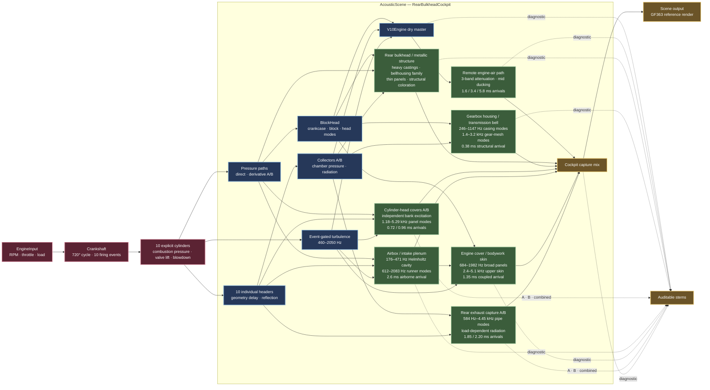

# Current Rust V10 audio architecture

This diagram describes the implemented Rust-only signal path as of the
`GF363` 7,499 RPM validation render. C++ and Faust are not part of this path.

## Current mix intent

The virtual listening position is fixed to the rear cockpit bulkhead behind the
driver. Structural paths arrive before the attenuated airborne engine path.
The full-range dry master is retained only as a diagnostic stem; it is not mixed
directly into the cockpit output.

| Capture path | Implemented role |
|---|---|
| Remote engine air | Filtered mass and restrained direct engine identity |
| Rear bulkhead | Main medium-frequency structural resonance |
| Gearbox housing | Lower, heavier casting and torsional resonance |
| Head covers A/B | Short, bright mechanical detail from each bank |
| Airbox/plenum | Airborne intake body and aspiration |
| Engine cover | Hollow, laminated bodywork-panel radiation |
| Rear exhaust A/B | Load-dependent collector and tailpipe radiation |

The renderer writes each path independently so perceptual changes can be
validated without guessing which subsystem caused them.
