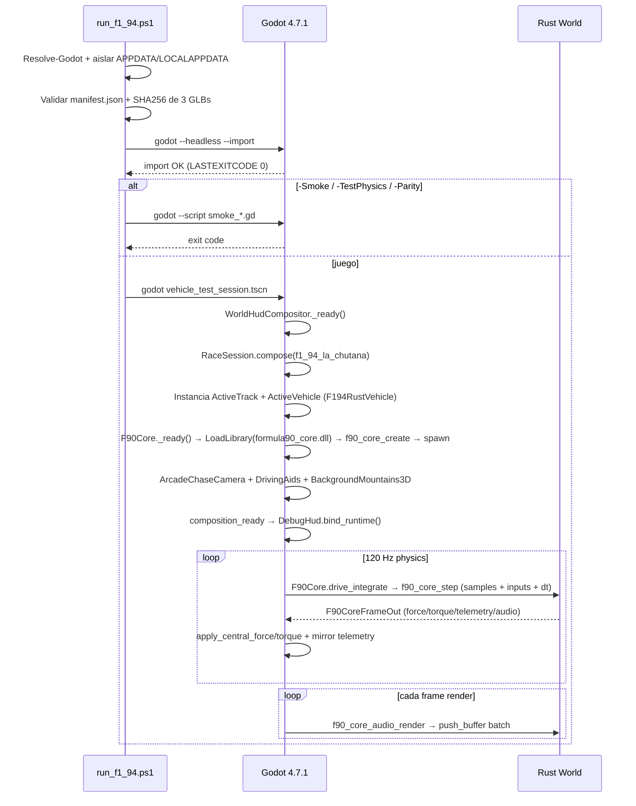

# ARCHITECTURE — Mapa Actual del Proyecto Formula-90s

> **Scope:** Estado real a fecha de `run_f1_94.ps1`. Cubre **todo** lo que se ejecuta cuando lanzas ese script: pipeline de arranque, escena de bootstrap, composición de pista+vehículo, nodos Godot, clases C++ (GDExtension), scripts GDScript y assets GBL/GLB.  
> **Entrada única:** `.\scripts\run_f1_94.ps1` → `game/scenes/runtime/vehicle_test_session.tscn`  
> **Complementos:** `docs/architecture/runtime-map.md` (histórico), `docs/architecture/overview.md`, `PROJECT_STATE.md` — este archivo es el mapa **canónico** del runtime vivo.

---

## 1. Resumen ejecutivo

Formula-90s es un juego de Fórmula 1 arcade/simcade en **Godot 4.7.1 (GL Compatibility) + C++20 GDExtension + Rust** con una **fachada orquestadora** (`formula90_core.dll`) que centraliza física, audio y módulos futuros en un solo handshake.

```
Godot Editor / Runtime  ── GDExtension ──►  libformula90s.dll (C++20)
                              │                    │
                              │              ┌─────┴─────┐
                              │              │  F90Core  │  ← único orquestador que vive en vehicle_test_session.tscn
                              │              └─────┬─────┘
                              │                    │ LoadLibrary("formula90_core.dll")
                              │              ┌─────▼─────┐
                              │              │ game/core │  Rust facade: CoreFacade
                              │              │  (formula90_core.dll)  │
                              │              └─┬───┬───┬─┘
                              │            sim │   │audio │modules
                              │        game/sim│   │vehicle_audio_engine │weather/ai stubs
                              │                ▼   ▼
                              │         vehicle_physics_engine (solver tri-raycast)
                              │
Godot Scene Tree  ◄────────────┘
  RaceSession, VehicleRigidBody, Camera, HUD, Telemetry, Input
  Assets GLB desacoplados (chassis + 2 wheel GLBs + albedos PNG)
```

**Invariant:** `Fail Faster, Adapt Faster` — cada subsystem valida su contrato y falla con mensaje antes de mutar estado.

---

## 2. `run_f1_94.ps1` — El pipeline de ejecución real

**Archivo:** `scripts/run_f1_94.ps1` — 117 líneas. Es la **única** forma soportada de lanzar el juego.

### 2.1 Resolución de Godot y aislamiento de AppData

```powershell
Resolve-Godot:
  1. $GodotPath explícito (param)
  2. $env:GODOT_BIN
  3. .tools/godot/Godot_v4.7.1-stable_win64_console.exe
  -> throw si no existe 4.7.1

Runtime isolation:
  $env:APPDATA      = .tools/appdata        # evita contaminar perfil del host
  $env:LOCALAPPDATA = .tools/localappdata
```

### 2.2 Validación de assets desacoplados (antes de importar)

```
game/assets/models/vehicles/f1_94/decoupled/manifest.json
  asset == "F1_94"  AND  standard == "Formula-90 GEVP decoupled visual asset"
  geometry/F1_94_chassis_geometry.glb      SHA256: 5C5CE50E...
  geometry/F1_94_wheel_front_geometry.glb  SHA256: 0F992399...
  geometry/F1_94_wheel_rear_geometry.glb   SHA256: 32A9F4E7...
  -> throw si falta o hash mismatch (fail-fast)
```

### 2.3 Fases de ejecución

```
┌──────────────────────────────────────────────────────────────────────┐
│  godot --headless --path game --import   (siempre)                  │
│  Import + reimport de .glb + .wav + bank_manifest.json              │
└──────┬───────────────────────────────────────────────────────────────┘
       │
       ├─ -SmokeAudio       → godot --script res://tests/smoke_test_f1_94_audio.gd         (exit)
       ├─ -SmokeBackground  → godot --script res://tests/smoke_test_mountains_3d.gd        (exit)
       ├─ -Smoke            → smoke HUD + smoke background (dos scripts secuenciales)       (exit)
       ├─ -TestPhysics      → cargo test (vehicle_physics_engine) + test_f1_94_rust_physics.gd (exit)
       ├─ -Parity           → test_f1_94_la_chutana_parity.gd (PHY-010, paridad headless)  (exit)
       ├─ -ValidateRuntimeOnly → solo valida manifest+hash+import, sin lanzar ventana      (return)
       │
       └─ (sin flags)       → godot --path game  res://scenes/runtime/vehicle_test_session.tscn
                              Ventana 640x360 viewport → 1280x720 window, canvas_items stretch
                              physics_ticks_per_second = 120
```

**Scene que se inicia en modo juego:** `vehicle_test_session.tscn` — ver §3.

> `project.godot: run/main_scene = res://scenes/bootstrap/bootstrap.tscn` solo aplica cuando abres el proyecto en el editor y pulsas F5. `run_f1_94.ps1` lo **overridea** pasando la escena como argumento posicional.

---

## 3. Árbol de escenas del runtime vivo

### 3.1 `vehicle_test_session.tscn` (entry point de `run_f1_94.ps1`)

```
VehicleTestSession  (WorldHudCompositor)          ← Control fullscreen
├─ session_config = res://data/race_sessions/f1_94_la_chutana.tres (RaceSessionConfig)
├─ WorldPresenter   (TextureRect)                 ← muestra WorldViewport.get_texture()
├─ WorldViewport    (SubViewport 640x360, UPDATE_ALWAYS) ← aquí vive TODO el mundo 3D
│   └─ RaceSession  (Node3D, race_session.gd)     ← se instancia en WorldHudCompositor._ready()
└─ HudLayer         (CanvasLayer layer=1)
    └─ DebugHud     (debug_hud.tscn → ArcadeRaceHud + SpeedGauge + RetroHud + Minimap)
└─ F90Core          (Node3D, C++ F90Core)         ← hermano de WorldHudCompositor, orquestador
```

### 3.2 `RaceSession.compose()` — composición data-driven

`RaceSession` (`game/scenes/runtime/race_session.gd`, 202 líneas) no hardcodea nada. Lee un `RaceSessionConfig`:

```
RaceSessionConfig (Resource)
├─ selected_vehicle: VehicleDefinition
│   id = &"f1_94"  →  vehicle_scene = res://scenes/vehicles/f1_94/f1_94_rust.tscn
└─ selected_track: TrackDefinition
    id = &"la_chutana"  →  track_scene = res://scenes/tracks/test_field/la_chutana_generated.tscn
    map_data = res://scenes/ui/la_chutana_hud_map.tres (TrackMapData)
    background_preset_path = "res://assets/backgrounds/la_chutana_snes_day/background.json"
```

`compose()` hace:

```
1. Instancia track_scene → $TrackContainer/ActiveTrack
   Busca Marker3D "VehicleSpawn" (find_child + grupo "vehicle_spawn")

2. Instancia vehicle_scene → $VehicleContainer/ActiveVehicle
   Obtiene VehicleRigidBody (F194RustVehicle) → reset_vehicle(spawn_pos + spawn_height, yaw)

3. _add_runtime_systems():
   ├─ CameraRig (arcade_chase_camera_rig.tscn → ArcadeChaseCamera + Camera3D)
   │   car_path = ../VehicleContainer/ActiveVehicle/VehicleRigidBody
   ├─ DrivingAids (driving_aids.gd, 5 ayudas)
   │   vehicle_node = ActiveVehicle/VehicleRigidBody
   └─ _setup_background(camera):
       ├─ Intenta BackgroundMountains3D (mountains_3d/manifest.json) ← NUEVO, preferido
       │   sky_dome GLB + far_ring GLB + near_ring GLB + Sprite3D waterfalls animados
       │   Si ok → _hide_legacy_background() y return
       └─ Fallback legacy:
           ├─ BackgroundSkybox (BackgroundSkybox) + BackgroundController (parallax 2D)
           └─ _hide_legacy_background() (oculta SourceSkyboxRig + BG_CANVAS)
```

### 3.3 `world_hud_compositor.gd` — bridge HUD ↔ mundo

```
WorldHudCompositor (Control)
  SESSION_SCENE = race_session.tscn
  session_config: RaceSessionConfig (export)

  _ready():
    world_presenter.texture = world_viewport.get_texture()
    session = SESSION_SCENE.instantiate() as RaceSession
    session.config = session_config
    session.composition_ready.connect(_on_composition_ready)
    world_viewport.add_child(session)

  _on_composition_ready(vehicle, track, aids):
    debug_hud.bind_runtime(vehicle, aids)
    minimap.map_data = session_config.selected_track.map_data
    minimap.set_target(vehicle)
    tuning_panel.bind_vehicle(vehicle, parent)
```

### 3.4 `bootstrap.tscn` (ruta F5 del editor, no usada por `run_f1_94.ps1`)

```
Bootstrap (GameBootstrap, C++ GameBootstrap)
  menu_scene_path       = res://scenes/ui/main_menu.tscn
  track_scene_path      = res://scenes/tracks/test_field/la_chutana_generated.tscn
  world_compositor_scene_path = res://scenes/runtime/world_hud_compositor.tscn
  _ready() → show_menu()
  show_menu() / start_game() / quit_game() → replace_content(path) (instancia PackedScene como "Content")
```

---

## 4. Capas de clases y objetos — mapeo completo por tecnología

### 4.1 C++ GDExtension — `native/` (compilado vía `SConstruct` → `libformula90s.*.dll`)

**Build:** `SConstruct` usa `third_party/godot-cpp/SConstruct`, C++20, sources `native/src/*.cpp` + `core/ vehicle/ camera/ presentation/ ui/ audio/ sim/`. Output `game/addons/formula90s/bin/libformula90s<suffix>.dll`. `formula90s.gdextension` mapea `compatibility_minimum=4.7`, `reloadable=true`.

**Registro:** `native/src/register_types.cpp` — `initialize_formula90s_module(SCENE)` registra 15 clases:

| Clase C++ | Base Godot | Ficheros | Rol en runtime |
|-----------|-----------|----------|----------------|
| `GameBootstrap` | `Node` | `core/game_bootstrap.hpp/.cpp` | Orquestador de pantallas (menu ↔ juego) — solo vía F5/editor |
| `ResetManager` | `Node` | `core/reset_manager.hpp/.cpp` | Reset a spawn (legacy, no usado en la ruta F90Core) |
| `F194RustVehicle` | `RigidBody3D` | `vehicle/f1_94_rust_vehicle.hpp/.cpp` | **Vehículo jugable** — 12 RayCast3D, bridge a Rust; ver §4.1.1 |
| `F90SimBridge` | `Node3D` | `sim/f90_sim_bridge.{h,hpp,cpp}` | Bridge legacy `game_sim` standalone (deprecado, reemplazado por F90Core pero aún registrado) |
| `F90Core` | `Node3D` | `core/f90_core.{h,hpp,cpp}` | **Orquestador fachada** — único handshake `formula90_core.dll`, ver §4.1.2 |
| `ArcadeChaseCamera` | `Node3D` | `camera/arcade_chase_camera.{hpp,cpp}` + `camera_math.hpp` | Cámara chase arcade con VehicleAdapter |
| `VehicleVisual3DController` | `Node3D` | `presentation/vehicle_visual_3d_controller.{hpp,cpp}` + `vehicle_visual_3d_math.hpp` | Visual 3D dinámico (steer, roll, pitch, wheel spin) |
| `VehicleVisual3DConfig` | `Resource` | `presentation/vehicle_visual_3d_config.{hpp,cpp}` | Resource config para el visual controller |
| `DirectionalVehicleSprite` | `Sprite3D` | `presentation/directional_vehicle_sprite.{hpp,cpp}` + `directional_sprite_math.hpp` | Sprite direccional 8-orientaciones (decor / validación, no jugador) |
| `DirectionalSpriteValidationController` | `Node` | `presentation/directional_sprite_validation_controller.{hpp,cpp}` | Validador del sprite direccional |
| `EngineAudioConfig` | `Resource` | `audio/engine_audio_config.{hpp,cpp}` + `engine_dsp.hpp` | Resource config del EngineAudioController genérico |
| `EngineAudioController` | `Node` | `presentation/engine_audio_controller.{hpp,cpp}` | Audio procedural por muestras (genérico, no usado en F1-94) |
| `VehicleAudioControllerNative` | `Node` | `presentation/vehicle_audio_controller_native.{hpp,cpp}` | Audio nativo Rust `vehicle_audio_engine` legacy (reemplazado por F90Core) |
| `MainMenuController` | `Control` | `ui/main_menu_controller.{hpp,cpp}` | Lógica del menú principal (start/quit signals) |
| `DebugHudController` | `Control` | `ui/debug_hud_controller.{hpp,cpp}` | HUD debug C++ |
| `StaticMinimapController` | `Control` | `ui/static_minimap_controller.{hpp,cpp}` | Minimap estático 2D |

#### 4.1.1 `F194RustVehicle` — detalle

`native/include/formula90s/vehicle/f1_94_rust_vehicle.hpp` (359 líneas). `RigidBody3D` con:

```
Propiedades editor:
  mass=505, gravity_scale=0, collision_layer=2, collision_mask=1
  chassis_node, FL/FR/RL/RR wheel NodePaths
  ray_fl_in .. ray_rr_out (12 NodePaths: 4 ruedas × Inner/Center/Outer)
  enable_player_input, throttle/steering/brake/handbrake/clutch, gear_request, automatic_transmission
  Tuning: motor_drag, max_torque, brake_force_multiplier, front_brake_bias, stability_yaw_strength,
          enable_stability, steering_exponent/speed, countersteer_speed, max_steering_angle,
          coefficient_of_drag, frontal_area, air_density, idle_rpm/max_rpm, vehicle_mass
          diff_* (Salisbury LSD: preload, power/coast ramps, clutches, mu)
          aids_enabled_mask (uint32 bit0=ABS .. bit7=brake-assist)
          inertia_multiplier_*, suspension_*_*

FFI (C-ABI v7, header formula90_physics.h):
  FnPhysicsCreateDefault / CreateFromJson / CreateWithPos / Reset
  FnPhysicsSolveForces / Step / GetWheelAnchorLocal / GetTriRaySpan / GetRayLength
  FnPhysicsGetVehicleMass / GetDefaultSpawnHeight / GetCenterOfMassLocal / Destroy
  FnPhysicsAbiVersion / BuildSha / GetRuntimeConfig / ApplyRuntimeConfig

Runtime:
  void *sim_ptr_, *dll_handle_, raycasts_[4][3], wheel_nodes_[4]
  _ready() → load_rust_dll(), setup_raycasts(), inertia init
  _integrate_forces(state) → si bridge_controlled_: delega a F90Core::drive_integrate() o F90SimBridge::drive_integrate()
                            si no: solve_forces_for_state() directo contra vehicle_physics_engine.dll
  _notification(), _exit_tree() → unload
  collect_core_samples(CSimTriRaycastSample[4]) / apply_core_motion() / apply_core_telemetry()
  set_bridge_controlled(bool) / set_sim_bridge() / set_core_driver(F90Core*)
  get_wheel_compressions/spins/slips/drive_torques/normal_forces() → PackedFloat64Array
```

**Escenas que lo instancian:**

- `f1_94_rust.tscn` — **vehículo canónico** usado por `VehicleDefinition f1_94`:
  ```
  F194Rust (Node3D)
  ├─ F194RustInputController (GDScript)
  └─ VehicleRigidBody (F194RustVehicle + f1_94_rust_vehicle.gd)
     ├─ ChassisVisual (F1_94_chassis_geometry.glb PackedScene)
     ├─ ExternalAlbedoBinder (GDScript)
     ├─ 3 CollisionShape3D (tub/nose/rear BoxShape3D)
     ├─ FrontLeft/Right, RearLeft/Right (Node3D + wheel GLBs)
     └─ 12 RayCast3D: RayCast_FL/R_In/Mid/Out × 4 ruedas (pos ±0.676..0.916, target -0.65y)
  ```
- `f1_94.tscn` — vehículo **legacy GEVP** (`Vehicle` + `Wheel` + `VehicleAssembler`), no usado en la ruta `run_f1_94.ps1` pero activo en tests/legacy.

#### 4.1.2 `F90Core` — fachada orquestadora (el corazón del runtime actual)

`native/include/formula90s/core/f90_core.hpp` (179 líneas) + `native/src/core/f90_core.cpp` (603 líneas).

```
ABI: EXPECTED_ABI_VERSION = 2
Carga: LoadLibraryW("formula90_core.dll") probando 7 candidatos (res://addons/formula90s/bin/*.dll + game/...)
       GetProcAddress: f90_core_abi_version/create/destroy/spawn/reset/apply_runtime_config/step/audio_render/trigger/readouts
       Valida abi_ver == 2, símbolos requeridos != null → fail-fast

Propiedades Godot (ADD_PROPERTY):
  fixed_dt (1/120), config_json_path (res://data/vehicles/f1_94/f1_94_physics.json),
  use_canonical_config (bool), target_vehicle_path (NodePath), debug_throttle,
  enable_audio (bool), bank_dir (res://sounds/banks/v10_vehicle), modules ("weather,ai"),
  idle_rpm (1000), max_rpm (15000)
  Readouts (solo getter): last_norm/rpm/throttle/slip/speed_kph/engine_gain, last_weights/pitches,
                          last_trigger, surface, active_bed, engine_band_native_rpm, is_engine_loaded/audio_active

Runtime:
  void *dll_handle_, *core_, uint32_t entity_id_, FnCore* fns, F90CoreFrameOut frame_ (344 bytes)
  Ref<AudioStreamGenerator> generator_; Object *audio_player_, *audio_playback_; mix_l_/mix_r_ buffers
  _ready() → load_dll() → f90_core_create(opts_json) → f90_core_spawn() → ensure_vehicle_bus() + create_audio_nodes()
           opts_json = {bank_dir, config_json_path, use_canonical, fixed_dt, enable_audio, idle_rpm, max_rpm, modules[]}
  _physics_process() → resuelve F194RustVehicle (target_path o find_first_vehicle) → veh->set_bridge_controlled(true) + set_core_driver(this)
  drive_integrate(veh, state) — llamado DESDE F194RustVehicle::_integrate_forces (contexto raycasts frescos):
      1. Lee inputs de veh (throttle/brake/steer/handbrake/clutch/gear_request/aids_mask)
      2. veh->collect_core_samples(samples[4])  (12 RayCast3D → CSimTriRaycastSample)
      3. Captura pose/velocidad Godot (state->get_transform/linear_velocity/angular_velocity)
      4. fn_step_(core, id, pos, quat, lin, ang, inputs, aids_mask, dt, samples, &frame_)  → F90CoreFrameOut
      5. Aplica fuerza/torque: state->apply_central_force/torque(frame.force/torque)
      6. Espeja telemetría: veh->apply_core_telemetry(CSimTelemetry{...}, dt)
  _process() → pump_audio() → get_frames_available → fn_audio_render(mix_l, mix_r, n) → push_buffer(PackedVector2Array batch)
  trigger(name) → fn_audio_trigger(code)  (shift_up/down, impact_*, engine_backfire, scrape…)
  reset_vehicle() / reset_core_at(x,y,z,yaw) / apply_runtime_config(F90RuntimeConfig)
  _exit_tree() → stop audio_player → unload_dll()

Layout guards: static_assert(offsetof(F90CoreFrameOut, field)==expected) — 19 asserts, sizeof==344
```

---

### 4.2 GDScript — `game/addons/formula90s/scripts/` + `game/scenes/runtime/`

Cada capa delgada de glue y orquestación declarativa:

| Script | Clase | Rol |
|--------|-------|-----|
| `f1_94_rust_vehicle.gd` | `F194RustVehicleGD extends F194RustVehicle` | Wrapper GDScript del RigidBody; resuelve 12 RayCasts por nombre, expone `front_weight_distribution`, `throttle_input` alias, `get_raycast_list/dict()`, `get_telemetry_snapshot()` |
| `f1_94_rust_input_controller.gd` | `F194RustInputController extends Node3D` | Lee `InputMap` (InputBindings) cada `_physics_process` → `set_throttle/steering/brake/handbrake/clutch/gear_request` en el vehicle; maneja `ToggleTransmission`, `ToggleTractionControl` (bit1), `ResetVehicle` (pos+yaw capturados en `_ready`), inversión throttle/brake en R |
| `driving_aids.gd` | `DrivingAidsController extends Node` | 5 ayudas (AUTO/ESTAB/DIRECC/FRENOS/GRIP) vía `VehicleTunableContract`; toggle con `aid_1..5`, captura baseline, multiplica params con floors |
| `vehicle_tunable_contract.gd` | `VehicleTunableContract` | `get_value/set_value(vehicle, prop)` genérico duck-typed (usado por DrivingAids y TuningPanel) |
| `handling_tuning_panel.gd` | (panel debug) | `bind_vehicle(vehicle, parent)` — sliders que llaman a los setters del `F194RustVehicle` (diff, aero, steering, braking…) |
| `input_bindings.gd` | `InputBindings` (Autoload) | **Única fuente de verdad** de InputMap; `_init()` registra 13 acciones (Throttle, Brakes, Steer Left/Right, Handbrake, Clutch, Shift Up/Down, aid_1..5, ui_back_to_menu, ShowDebug, ToggleTransmission, ToggleTractionControl, Reset Vehicle) con deadzones y eventos teclado+joypad |
| `telemetry_manager.gd` | `TelemetryManager` (Autoload) | Busca `F194RustVehicle` (prioritario) o `Vehicle` (GEVP) cada 1s; muestrea 20 Hz (50ms) a CSV `res://telemetry/telemetry_*.csv` + setup JSON con snapshot de todos los tunables y provenance |
| `audio/vehicle_audio_controller.gd` | `VehicleAudioController extends Node` | Thin glue legacy GDScript para bank WAV `v10_vehicle` (5 bandas + beds + one-shots); hoy **no usado** en f1_94_rust (usa F90Core nativo), pero referencia del modelo de audio |
| `audio/audio_telemetry.gd` | `AudioTelemetry extends Node` | Captura opcional (disabled por defecto) del mix Rust: muestrea `last_*` a `audio_telemetry_*.csv` |
| `audio/ensure_vehicle_bus.gd` | `VehicleAudioBus` (Autoload) | Crea bus `Vehicle` con `AudioEffectLimiter` si no existe |
| `vehicle_definition.gd` | `VehicleDefinition extends Resource` | `id, display_name, vehicle_scene:PackedScene` — usado por RaceSession |
| `track_definition.gd` | `TrackDefinition extends Resource` | `id, display_name, track_scene, map_data, background_preset/path`; `get_effective_background_preset()` |
| `race_session_config.gd` | `RaceSessionConfig extends Resource` | `selected_vehicle, selected_track; is_valid_config()` |
| `background_controller.gd` | `BackgroundController extends Node3D` | Parallax 2D legacy multicapa (validate preset, `load_preset`, `update_parallax(yaw,pitch)`, follow camera XZ+yaw) |
| `background_mountains_3d.gd` | `BackgroundMountains3D extends Node3D` | **Procedural 3D** — carga `mountains_3d/manifest.json`, instancia sky_dome/far/near GLBs como MeshInstance3D unshaded vertex-color, crea Sprite3D waterfalls animadas 4 frames @8fps, sky sigue XZ de cámara, montañas parallax real por profundidad |
| `background_preset.gd` / `background_skybox.gd` / `background_layer_instance.gd` / `background_skybox_config.gd` / `background_layer_config.gd` / `background_validator.gd` | Data-driven background | Resources + loaders JSON para el sistema legacy |
| `arcade_race_hud.gd` | `ArcadeRaceHud extends Control` | Lee `vehicle.get("speed")/current_gear/motor_rpm`, alimenta `ArcadeSpeedGauge` + `RetroHud.set_readout()`; notificaciones `aid_toggled` 2.4s con fade |
| `track_minimap_controller.gd` | `TrackMinimapController` | `map_data:TrackMapData` + `set_target(vehicle)` — dibuja minimap fijo |
| `f1_94_external_albedo_binder.gd` | `ExternalAlbedoBinder extends Node` | Asigna `textures/albedo/*.png` a los Material de los GLB desacoplados (albedo externo, no embebido) |
| `race_session.gd` | `RaceSession extends Node3D` | Orquestador de composición (ver §3.2) |
| `world_hud_compositor.gd` | `WorldHudCompositor extends Control` | SubViewport compositor + bridge a DebugHud (ver §3.3) |
| `formula_vehicle_controller.gd` | `FormulaVehicleController` (legacy GEVP) | Solo ruta `f1_94.tscn` legacy |
| `vehicle_assembler.gd` | `VehicleAssembler extends Node` | `spec:VehicleSpec → vehicle_node:Vehicle` — desacopla tuning de .tscn (solo GEVP legacy) |

**GEVP (`game/addons/gevp/`)** — addon de terceros (Godot Extended Vehicle Physics) no usado en la ruta canónica F1-94 Rust, pero presente para referencia y tests: `vehicle.gd`, `wheel.gd`, `vehicle_controllergd.gd`, `engine_sound.gd`, `wheel_smoke.gd`, `camera.gd`, `debug.gd`.

---

### 4.3 Rust — `game/physics/engine` + `game/sim` + `game/audio/engine` + `game/core`

#### Crate `vehicle_physics_engine` (`game/physics/engine/`)

```
Cargo: serde, serde_json, thiserror — cdylib + rlib
Módulos: aero, ffi, powertrain, simulation, suspension, telemetry, tire, types, vehicle_config
ABI: F1_94_PHYSICS_ABI_VERSION = 7 (formula90_physics.h)
  f1_94_physics_create_default / _from_json / _with_pos / _reset
  f1_94_physics_solve_forces (recomendado, Godot aplica fuerza) / _step (legacy standalone)
  get_wheel_anchor_local / tri_ray_span / ray_length / vehicle_mass / spawn_height / center_of_mass
  get/apply_runtime_config (F90RuntimeConfig), abi_version, build_sha, destroy
Tipos C (formula90_physics.h):
  F90RaycastHit {is_colliding, distance, point, normal, surface_type}
  F90TriRaycastSample {inner, center, outer}  ×4 ruedas
  F90VehicleInput {throttle, steering, brake, handbrake, clutch, gear_request}
  F90BodyKinematics {pos, quat, lin_vel, ang_vel}
  F90ForceTorqueOutput {force, torque}, F90TelemetryOutput {sim_time..tc_active, aids_mask}
  F90RuntimeConfig {vehicle_mass, front_brake_bias, max_steering_angle, max_torque, aero,
                   steering_*, automatic_transmission, diff_*(Salisbury), aids_mask,
                   inertia_multiplier_xyz, suspension_* }
```

#### Crate `vehicle_audio_engine` (`game/audio/engine/`)

```
Cargo: serde, serde_json, thiserror, sha2 — cdylib + rlib
Rol: Mixer determinista sample-accurate, bank loader, adapter GEVP
Bank: game/sounds/banks/v10_vehicle (bank_manifest.json + WAVs por rol)
  ENGINE_BANDS = [engine_idle, engine_low, engine_mid, engine_high, engine_redline] (5 bandas triangular crossfade)
  BANK_CENTERS = [0,0.25,0.5,0.75,1], BAND_WIDTH=0.25, PITCH_MIN=0.5 MAX=3.5
  Suface beds: surf_rumble/grass/sand (asphalt = silencio)
  One-shots: shift_up/down, impact_hit_1..4, impact_barrier/cone, engine_backfire/fire, scrape
  TRIM_DB=-6, VOLUME_FLOOR_DB=-80, VOLUME_SMOOTH_TAU=0.015s
```

#### Crate `game_sim` (`game/sim/`)

```
Cargo: vehicle_physics_engine, serde, bincode — cdylib + rlib
Rol: Snapshot-server autoritativo (World/scene graph, vehicles, aids, session)
  Worlds/Entities, snapshot serializable para mirror Godot (thin client)
```

#### Crate `formula90_core` (`game/core/`) — LA FACHADA

```
Cargo: vehicle_physics_engine + game_sim + vehicle_audio_engine + serde/json/bincode — cdylib + rlib
Módulos: frame.rs (CoreFrame/AudioReadouts/ModuleOutput), ffi.rs (F90CoreFrameOut + layout_tests),
         lib.rs (CoreFacade), audio.rs, modules/{weather_stub, ai_stub}, module.rs (trait SimModule)

CoreFrame (frame.rs): time_ms, force[3], torque[3], speed_kmh, rpm, gear, steer, throttle,
                     lat/long/vert_g, fl/fr/rl/rr comp_mm, front/rear slip, tc_active, drive_torque,
                     px/py/pz/yaw, lvx/lvy/lvz/avx/avy/avz, audio:AudioReadouts, modules:Vec<ModuleOutput>

F90CoreFrameOut (f90_core.h, 344 bytes, static_asserts):
  force/torque (6×f64) | speed_kmh/rpm/gear/steer/throttle/lat/long/vert_g/comp×4/slip×2/tc/drive
  | px/py/pz/yaw/lvx/lvy/lvz/avx/avy/avz | surface_code/active_bed_code/trigger_code
  | last_norm/rpm/throttle/speed_kph/slip/engine_gain | weights[5]/pitches[5]

C-ABI v2 (f90_core.h):
  f90_core_abi_version() → 2, f90_core_create(opts_json, err_buf) → core*, destroy, spawn→id,
  reset(core,x,y,z,yaw), apply_runtime_config(core,id,F90RuntimeConfig)→bool,
  step(core,id, pos, quat, lin, ang, throttle,brake,steer,handbrake,clutch, gear_req, aids_mask, dt, samples, &out),
  audio_render(core, out_l, out_r, n)→u32, audio_trigger(core, code)→bool, audio_readouts(core,&out),
  snapshot(core, out, cap, &len)

Trait SimModule (module.rs): name()→&str, tick(&mut ModuleCtx)→Result, snapshot()→Vec<u8>, reset()
  ModuleCtx { fixed_dt, clock_ms (del core, nunca wall-clock), latest:&CoreFrame, emit }
  Bucle CoreFacade::step: física → registry.tick_all(ctx) → audio → publica CoreFrame (RwLock<Arc>)

Stubs presentes: weather_stub, ai_stub — onboarding de módulo nuevo: crate + dep en Cargo.toml +
                 impl SimModule + registro + nombre en F90Core.modules
```

---

### 4.4 Assets GBL/GLB — `game/assets/` + `game/sounds/` + `game/data/`

#### Geometría desacoplada F1-94 (GBL) — `game/assets/models/vehicles/f1_94/decoupled/`

```
manifest.json (v1, Formula-90 GEVP decoupled visual asset)
  coordinate: +X right, -X left, +Y up, -Z front, +Z rear, meter
  decoupling: geometry = positions/triangles/normals/UV0/hierarchy/JNT_*+DATUM_*, sin images/shaders
              albedo = 1 PNG externo por mesh, layout 64×64 preservado, UV0 intacto
  geometry_assets: F1_94_geometry.glb (assembly), F1_94_chassis_geometry.glb,
                   F1_94_wheel_front/rear_geometry.glb
  runtime_assets: chassis + wheel_front/rear (FL/FR comparten, RL/RR comparten)

Runtime GLBs (validados por hash en run_f1_94.ps1):
  geometry/F1_94_chassis_geometry.glb  (chassis, nose, front/rear wings, cockpit LCDs, helmet, suspensions)
  geometry/F1_94_wheel_front_geometry.glb
  geometry/F1_94_wheel_rear_geometry.glb
  Cada GLB importado por Godot como PackedScene (MeshInstance3D)

Meshes (29 en manifest): GEO_AERO_FRONT/REAR_WING, GEO_BODY/C HASSIS, 8× LCD, HELMET, NOSE,
                         4× SUSPENSION, 4× WHEEL_FL/FR (hub+tire_inner/outer+tread),
                         4× WHEEL_RL/RR

Albedos externos (no embebidos, binder los asigna):
  textures/albedo/GEO_*.png  (1 por material slot MAT_GEO_*)
  Cargados por f1_94_external_albedo_binder.gd → StandardMaterial3D.albedo_texture
  Ventaja: evita embedding/shader issues sin repack UV
```

#### Audios

```
game/sounds/banks/v10_vehicle/bank_manifest.json + *.wav (construidos por tools/audio/bank_generator.py)
game/audio/engine + game/sounds/banks — fuente y artefacto del bank v10
```

#### Data-driven Resources (`game/data/`)

```
game/data/race_sessions/f1_94_la_chutana.tres ──► RaceSessionConfig ──► VehicleDefinition + TrackDefinition
game/data/vehicles/f1_94.tres (VehicleDefinition → f1_94_rust.tscn)
game/data/tracks/la_chutana.tres (TrackDefinition → la_chutana_generated.tscn + map_data + background_preset_path)
game/data/vehicles/f1_94/*.tres: f1_94_spec/gearbox/suspension/steering_brakes/tires/aero/engine/chassis + f1_94_physics.json
game/assets/backgrounds/la_chutana_snes_day/background.json (+ mountains_3d/manifest.json)
game/assets/skybox/ + la_chutana_waterfall_sheet.png
```

#### Pista La Chutana

```
scenes/tracks/test_field/la_chutana_generated.tscn (+ la_chutana_track.tscn base)
  Incluye: StaticBody3D colisión (Road/Grass/Gravel/Curb groups + surface_type metadata)
           VehicleSpawn Marker3D
           SourceSkyboxRig (legacy, ocultado si Mountains3D activo)
           WorldEnvironment (BG_CANVAS si mountains activo)
  Superficie: raycasts detectan vía grupos CollisionObject3D o metadata surface_type
```

---

## 5. Flujo de datos por tick (120 Hz physics + variable render)

```
                    ┌──────────────────────────────────────────────────────┐
                    │           Godot Physics Tick (120 Hz)                │
                    │        F194RustVehicle::_integrate_forces            │
                    └──────────────────┬───────────────────────────────────┘
                                       │ state: Transform, lin/ang vel, step dt
                                       │
              ┌────────────────────────▼────────────────────────┐
              │ F194RustInputController._physics_process        │  GDScript
              │ InputMap (InputBindings autoload) →             │
              │ throttle/brake/steer/handbrake/clutch/gear     │  throttle pow(exponent)
              │ togTrans/togTC/reset  → set_* en vehicle       │  R: invierte throttle/brake
              └────────────────────────┬────────────────────────┘
                                       │ vehicle.set_throttle_amount(...) etc.
                                       ▼
              ┌────────────────────────────────────────────────┐
              │ F90Core._physics_process                        │  C++
              │ find_first_vehicle → veh.set_bridge_controlled  │
              │ + set_core_driver(this)  (marca para integrate) │
              └────────────────────────┬────────────────────────┘
                                       │
                                       ▼  (Godot llama _integrate_forces con raycasts frescos)
              ┌────────────────────────────────────────────────┐
              │ F194RustVehicle::_integrate_forces(state)       │  C++
              │ if bridge_controlled:                           │
              │   └─► F90Core::drive_integrate(veh, state)      │
              │       1. throttle = debug_throttle ?: veh.thr   │
              │       2. collect_core_samples(12 RayCast3D →    │
              │          CSimTriRaycastSample[4])               │
              │       3. body = state.get_transform/lin/ang     │
              │       4. fn_step(core,id, pos,quat,lin,ang,     │
              │          throttle,brake,steer,handbrake,clutch, │
              │          gear, aids_mask, dt, samples, &frame)  │──► Rust formula90_core::CoreFacade::step
              │       5. state.apply_central_force/torque       │         physics solve (vehicle_physics_engine)
              │          (frame.force/torque)                   │         modules tick (weather/ai stubs)
              │       6. veh.apply_core_telemetry(tel, dt)      │         audio inputs → CoreFrame atómico
              │          (speed_kmh/rpm/gear/steer/lat_g/        │         publica RwLock<Arc<CoreFrame>>
              │           comp/slip/tc/drive_torque…)            │◄── frame: F90CoreFrameOut 344 bytes
              │       7. log cada 0.5s                          │
              └────────────────────────┬────────────────────────┘
                                       │ force/torque aplicado al RigidBody3D
                                       │ telemetría espejada en veh properties
                                       ▼
              ┌────────────────────────────────────────────────┐
              │ Godot Physics Server integra el RigidBody       │
              │ (colisiones, resuelve velocidad → nueva pose)   │
              └────────────────────────┬────────────────────────┘
                                       │
              ┌────────────────────────▼────────────────────────┐
              │ F90Core::_process (cada frame render)           │  C++
              │ pump_audio():                                   │
              │  frames = playback.get_frames_available()       │
              │  fn_audio_render(core, mix_l, mix_r, frames)    │──► Rust audio mixer sample-accurate
              │  batch = PackedVector2Array(mix_l/mix_r)        │◄── float L/R
              │  playback.push_buffer(batch)  (1 call, no       │
              │    per-sample Variant dispatch)                 │
              │  fn_audio_readouts(core, &frame) → surface/bed  │
              │  weights/pitches/trigger para HUD/telemetry     │
              └────────────────────────┬────────────────────────┘
                                       │
              ┌────────────────────────▼────────────────────────┐
              │ Presentation (cada _process)                    │
              │ ArcadeChaseCamera._process(delta)  (C++)        │  VehicleAdapter → smoothed chase, look-ahead, FOV
              │ VehicleVisual3DController._process (C++)        │  wheel spin, steer anim, roll/pitch, vibration
              │ BackgroundMountains3D._process (GDScript)       │  sky_dome sigue XZ cámara, waterfalls 4 frames
              │ ArcadeRaceHud._process (GDScript)               │  speed/gear/RPM → SpeedGauge + RetroHud
              │ TrackMinimapController                          │  minimap con map_data
              │ TelemetryManager._physics_process (20 Hz)       │  CSV telemetry + setup snapshot
              └─────────────────────────────────────────────────┘
```

**Determinismo:** `CoreFacade` es single-thread autoritativo; `clock_ms` viene del core (nunca wall-clock) — `std::time` vetado en módulos. `pump_audio` lee `latest` publicado por `step`; nunca ve física stale. Parity `facade_snapshot.bin` byte-idéntico a `game_sim` puro.

---

## 6. Dependencias y contratos entre capas

```
project.godot
  [autoload] InputBindings → TelemetryManager → VehicleAudioBus  (orden de inicialización)
  [physics]  ticks=120
  [rendering] gl_compatibility, canvas_textures filter=Nearest (pixel art HUD)
  [audio]    output_latency buffer 10ms (WASAPI shared-mode floor)
  main_scene = bootstrap.tscn (solo editor F5)

SConstruct → godot-cpp → libformula90s.*.dll → formula90s.gdextension (4.7, reloadable)

Rust workspace (4 crates, cada uno rlib+cdylib):
  vehicle_physics_engine  (base, sin deps internas)
  game_sim                (→ vehicle_physics_engine)
  vehicle_audio_engine    (independiente)
  formula90_core          (→ los 3 anteriores, es la fachada)

GDScript → C++: duck-typing vía Object::get/set + NodePaths (no linkage estático)
C++ → Rust: LoadLibrary + GetProcAddress + ABI version check + static_assert layouts
Rust → Rust: Cargo path deps (../physics/engine, ../sim, ../audio/engine)

Assets → Runtime: manifest.json SHA256 gate en PS1 + GLB PackedScene load + albedo PNG binder
Data → Runtime: .tres Resources (RaceSessionConfig/TrackDefinition/VehicleDefinition) instanciados por RaceSession
```

---

## 7. Clases y objetos instanciados en `vehicle_test_session` (inventario)

### Instancias vivas tras `RaceSession.compose()` con `f1_94_la_chutana`

```
WorldHudCompositor (Control) — 1 instancia, persistente
├─ WorldPresenter (TextureRect) — 1
├─ WorldViewport (SubViewport 640×360) — 1
│  └─ RaceSession (Node3D) — 1
│     ├─ TrackContainer (Node3D) — 1
│     │  └─ ActiveTrack (Node3D, la_chutana_generated) — 1
│     │     ├─ StaticBody3D colisión pista + grupos Road/Grass/Curb/Gravel — N
│     │     ├─ VehicleSpawn (Marker3D) — 1
│     │     ├─ SourceSkyboxRig (Node3D, oculto si Mountains3D) — 1
│     │     └─ WorldEnvironment (Environment BG_CANVAS si Mountains3D) — 1
│     ├─ VehicleContainer (Node3D) — 1
│     │  └─ ActiveVehicle (Node3D, F194Rust) — 1
│     │     ├─ F194RustInputController (Node3D, GDScript) — 1
│     │     └─ VehicleRigidBody (F194RustVehicle C++ + F194RustVehicleGD) — 1
│     │        ├─ ChassisVisual (MeshInstance GLB chassis) — 1
│     │        ├─ ExternalAlbedoBinder (Node) — 1
│     │        ├─ 3× CollisionShape3D (BoxShape3D) — 3
│     │        ├─ 4× Wheel Node3D (FL/FR/RL/RR + GLB wheel) — 4 (+2 Orientation wrappers)
│     │        └─ 12× RayCast3D (FL/FR/RL/RR × In/Mid/Out) — 12
│     ├─ CameraRig (Node3D) — 1
│     │  └─ ArcadeChaseCamera (Node3D, C++) — 1
│     │     └─ Camera3D — 1
│     ├─ DrivingAids (Node, GDScript, 5 ayudas) — 1
│     └─ Background — uno de:
│        ├─ BackgroundMountains3D (Node3D, GDScript) — 1  [preferido]
│        │  ├─ SkyDome (MeshInstance3D, unshaded, depth_disabled) — 1
│        │  ├─ FarMountains (MeshInstance3D, R=1600m, depth_opaque) — 1
│        │  ├─ NearMountains (MeshInstance3D, R=1150m) — 1
│        │  └─ N× Waterfall Sprite3D (hframes=4, 8fps) — N (desde manifest.waterfalls)
│        └─ (fallback) BackgroundSkybox + BackgroundController + N× BackgroundLayerInstance
├─ HudLayer (CanvasLayer) — 1
│  └─ DebugHud (ArcadeRaceHud, Control) — 1
│     ├─ SpeedGauge (ArcadeSpeedGauge) — 1
│     ├─ RetroHud (retro_hud_display) — 1
│     ├─ AidMessage (Label) — 1
│     ├─ Minimap (TrackMinimapController) — 1
│     └─ HandlingTuningPanel — 1
└─ F90Core (Node3D, C++) — 1  (hermano de WorldViewport, no dentro)
   ├─ AudioStreamGenerator (Ref, 44100 Hz, buffer 0.06s, MIX_RATE_CUSTOM) — 1
   └─ AudioStreamPlayer (Object vía ClassDB, bus Vehicle) — 1
      └─ AudioStreamGeneratorPlayback — 1

Autoloads (siempre vivos):
  InputBindings (Node) — 1
  TelemetryManager (Node) — 1  (busca vehicle, escribe telemetry_*.csv 20 Hz)
  VehicleAudioBus (Node) — 1  (asegura bus Vehicle + limiter)
```

**Total objetos Godot creados en la sesión de prueba:** ~45 nodos 3D/UI + 12 raycasts + 2 viewports + 1 fachada Rust + 1 bus de audio.

---

## 8. Mapa de ficheros clave (dónde vive cada clase)

```
scripts/run_f1_94.ps1                          ← entry point

game/project.godot                             ← config 4.7, autoloads, physics 120Hz, render gl_compatibility
game/addons/formula90s/formula90s.gdextension  ← GDExtension loader (libformula90s.*.dll)
SConstruct + third_party/godot-cpp             ← build C++20
native/include/formula90s/
  register_types.hpp / src/register_types.cpp  ← registro 15 clases
  core/game_bootstrap.hpp  / core/f90_core.{h,hpp,cpp}
  sim/f90_sim_bridge.{h,hpp,cpp}
  vehicle/f1_94_rust_vehicle.hpp / formula90_physics.h (ABI v7)
  camera/arcade_chase_camera.hpp
  presentation/{vehicle_visual_3d_*, directional_*, engine_audio_*}
  audio/{engine_audio_config, engine_dsp}
  ui/{main_menu, debug_hud, static_minimap}_controller.hpp
native/src/  (*.cpp + *.obj compilados)

game/addons/formula90s/scripts/
  f1_94_rust_vehicle.gd / f1_94_rust_input_controller.gd
  driving_aids.gd / vehicle_tunable_contract.gd / handling_tuning_panel.gd
  input_bindings.gd (autoload) / telemetry_manager.gd (autoload)
  audio/{vehicle_audio_controller.gd, audio_telemetry.gd, ensure_vehicle_bus.gd}
  vehicle_definition.gd / track_definition.gd / race_session_config.gd
  background_*.gd (controller, mountains_3d, skybox, preset, validator, layer_*)
  arcade_race_hud.gd / track_minimap_controller.gd / arcane_speed_gauge.gd
  f1_94_external_albedo_binder.gd / forest.gd / vehicle_assembler.gd
game/scenes/
  bootstrap/bootstrap.tscn (+ GameBootstrap)
  runtime/{vehicle_test_session.tscn, world_hud_compositor.{tscn,gd}, race_session.{tscn,gd}, arcade_chase_camera_rig.tscn}
  vehicles/f1_94/{f1_94_rust.tscn (canónico), f1_94.tscn (GEVP legacy)}
  tracks/test_field/la_chutana_generated.tscn
  ui/{debug_hud.tscn, main_menu.tscn}
game/data/
  race_sessions/f1_94_la_chutana.tres
  vehicles/f1_94.tres + vehicles/f1_94/f1_94_physics.json + f1_94_*.tres (specs)
  tracks/la_chutana.tres + scenes/ui/la_chutana_hud_map.tres
game/assets/
  models/vehicles/f1_94/decoupled/{manifest.json, geometry/*.glb, textures/albedo/*.png}
  backgrounds/la_chutana_snes_day/{background.json, mountains_3d/manifest.json + *.glb}
  skybox/ + sounds/banks/v10_vehicle/
game/physics/engine/  (vehicle_physics_engine crate: src/{lib,ffi,simulation,suspension,tire,powertrain,aero,telemetry,types,vehicle_config}.rs)
game/sim/             (game_sim crate: src/lib.rs, bin/game_cli.rs)
game/audio/engine/    (vehicle_audio_engine crate)
game/core/            (formula90_core facade: src/{lib,ffi,frame,module,audio,modules/*.rs}, Cargo.toml)
```

---

## 9. GBL / Godot Build Language — estado

No hay fichero `.gbl` separado en este proyecto. El término **GBL** aquí se refiere a los **GLB (glTF Binary) assets** desacoplados + su manifest — el “build language” es el manifest JSON que describe el decoupling:

- `manifest.json` actúa como **Asset Build Language**: declara `geometry_assets`, `runtime_assets`, `meshes[]` con roles, material slots, albedos y vertex counts. `run_f1_94.ps1` lo valida como contrato build-time.
- Godot importa cada `.glb` vía su pipeline nativo (`.glb.import`) generando `Mesh + Material` placeholder; el binder externo reconecta albedos sin re-empaquetar UVs.
- No se usa `*.gbl` custom — si en el futuro se introduce un DSL de build, este manifest es su precedente.

---

## 10. Diagramas

### 10.1 Diagrama de clases (simplificado, runtime vivo)

```mermaid
classDiagram
    class Node
    class RigidBody3D
    class Node3D
    class Control
    class Resource

    class GameBootstrap {
        +String menu_scene_path
        +String track_scene_path
        +String world_compositor_scene_path
        +show_menu()
        +start_game()
        +quit_game()
    }

    class F194RustVehicle {
        +void* sim_ptr
        +RayCast3D raycasts[4][3]
        +double throttle/steering/brake/handbrake/clutch
        +int gear_request
        +uint32 aids_enabled_mask
        +double diff_preload / ramps / clutches
        +_integrate_forces(state)
        +collect_core_samples()
        +apply_core_telemetry()
        +set_bridge_controlled()
        +set_core_driver(F90Core*)
    }

    class F90Core {
        +void* core
        +uint32 entity_id
        +F90CoreFrameOut frame
        +fixed_dt / bank_dir / modules
        +drive_integrate(veh, state)
        +pump_audio()
        +trigger(name)
        +reset_vehicle()
    }

    class F90SimBridge {
        +void* world
        +uint32 entity_id
        +drive_integrate(veh, state)
    }

    class ArcadeChaseCamera {
        +double distance/height/damping
        +NodePath car_path
        +_process(delta)
    }

    class VehicleVisual3DController {
        +Ref~VehicleVisual3DConfig~ config
        +NodePath car_path
        +_process(delta)
    }
    class VehicleVisual3DConfig {
        +Vector3 model_scale/offset/rotation
        +double wheel_radius/steering/roll/pitch
    }

    class DirectionalVehicleSprite {
        +int orientation_count
        +String metadata_path
        +NodePath car_path
    }

    class VehicleTunableContract {
        <<static>> +get_value(vehicle, prop)
        <<static>> +set_value(vehicle, prop, val)
    }

    class InputBindings {
        <<Autoload>>
        +THROTTLE / BRAKES / STEER_LEFT / RIGHT
        +SHIFT_UP / DOWN / RESET_VEHICLE
        +_register(action, deadzone, events)
    }
    class TelemetryManager {
        <<Autoload>>
        +Node vehicle
        +_physics_process(delta) 20Hz CSV
    }

    class F194RustVehicleGD {
        +RayCast3D ray_fl_in .. ray_rr_out
        +float front_weight_distribution
        +get_raycast_list()
        +get_telemetry_snapshot()
    }
    class F194RustInputController {
        +Node vehicle_node
        +String action_throttle/brake/steer
        +_physics_process()
    }
    class DrivingAidsController {
        +Node vehicle_node
        +bool aids[5]
        +toggle(index)
    }

    class RaceSession {
        +RaceSessionConfig config
        +Node3D active_track / vehicle_root
        +Node active_vehicle
        +DrivingAidsController driving_aids
        +compose(config)
        +_setup_background(camera)
    }
    class WorldHudCompositor {
        +RaceSessionConfig session_config
        +SubViewport world_viewport
        +TextureRect world_presenter
        +_on_composition_ready(vehicle, track, aids)
    }

    class RaceSessionConfig {
        +VehicleDefinition selected_vehicle
        +TrackDefinition selected_track
        +is_valid_config()
    }
    class VehicleDefinition {
        +StringName id
        +PackedScene vehicle_scene
    }
    class TrackDefinition {
        +StringName id
        +PackedScene track_scene
        +TrackMapData map_data
        +String background_preset_path
        +get_effective_background_preset()
    }

    class ArcadeRaceHud {
        +Node vehicle / aids
        +bind_runtime(vehicle, aids)
    }
    class BackgroundMountains3D {
        +MeshInstance3D sky_dome/far/near
        +Array~Sprite3D~ waterfalls
        +setup(manifest_path)
        +set_camera_source(cam)
    }
    class BackgroundController {
        +BackgroundPreset active_preset
        +load_preset(preset)
        +set_camera_source(cam)
    }

    Node <|-- GameBootstrap
    Node <|-- DrivingAidsController
    Node <|-- TelemetryManager
    Node <|-- InputBindings
    Node3D <|-- F90SimBridge
    Node3D <|-- F90Core
    Node3D <|-- ArcadeChaseCamera
    Node3D <|-- VehicleVisual3DController
    Node3D <|-- RaceSession
    Node3D <|-- BackgroundController
    Node3D <|-- BackgroundMountains3D
    Node3D <|-- F194RustInputController
    RigidBody3D <|-- F194RustVehicle
    F194RustVehicle <|-- F194RustVehicleGD
    Control <|-- WorldHudCompositor
    Control <|-- ArcadeRaceHud
    Resource <|-- RaceSessionConfig
    Resource <|-- VehicleDefinition
    Resource <|-- TrackDefinition
    Resource <|-- VehicleVisual3DConfig

    F194RustVehicle --> F90Core : set_core_driver
    F90Core --> F194RustVehicle : drive_integrate
    RaceSession --> RaceSessionConfig : config
    RaceSessionConfig --> VehicleDefinition
    RaceSessionConfig --> TrackDefinition
    WorldHudCompositor --> RaceSession : instantiates
    BackgroundMountains3D --> Resource : manifest.json
```



### 10.2 Secuencia de arranque `run_f1_94.ps1`



---

## 11. Decisiones y estado pendiente

- **Fachada vs 3 DLLs:** Consolidada en `formula90_core.dll` (ABI v2). `F90SimBridge` + `VehicleAudioControllerNative` siguen registrados pero ya no son el path canónico.
- **Montañas 3D:** `BackgroundMountains3D` es el path preferido; `BackgroundController` queda como fallback legacy.
- **Assets desacoplados:** Gate SHA256 en PS1 garantiza que el runtime nunca corre con GLB corruptos.
- **Roadmap activo:** `docs/roadmap.md` + `docs/track-studio/*` + `docs/architecture/manifesto.md`. No duplicado aquí — se referencian.

---

## 12. Cómo regenerar / verificar este mapa

```powershell
# Verificar que el runtime sigue vivo (sin abrir ventana)
.\scripts\run_f1_94.ps1 -ValidateRuntimeOnly

# Smokes completos (headless)
.\scripts\run_f1_94.ps1 -Smoke
.\scripts\run_f1_94.ps1 -SmokeAudio
.\scripts\run_f1_94.ps1 -SmokeBackground
.\scripts\run_f1_94.ps1 -TestPhysics
.\scripts\run_f1_94.ps1 -Parity

# Juego (ventana)
.\scripts\run_f1_94.ps1

# Tras modificar Rust: rebuild de la fachada
.\scripts\build_windows.ps1   # compila game/core → formula90_core.dll → game/addons/formula90s/bin
# Tras modificar C++: rebuild GDExtension
scons target=template_release
scons target=template_debug
```

> Este documento se generó escaneando `scripts/run_f1_94.ps1`, `game/project.godot`, `SConstruct`, `native/include|src/**/*`, `game/addons/formula90s/scripts/**/*.gd`, `game/scenes/**/*.tscn`, `game/physics|sim|audio|core/Cargo.toml` + `src/**/*.rs`, `game/data/**/*.tres`, `game/assets/models/vehicles/f1_94/decoupled/manifest.json`, `native/include/formula90s/vehicle/formula90_physics.h` y `native/include/formula90s/core/f90_core.h`. Si añades una clase, añade su fila en §4 y su nodo en §7.
