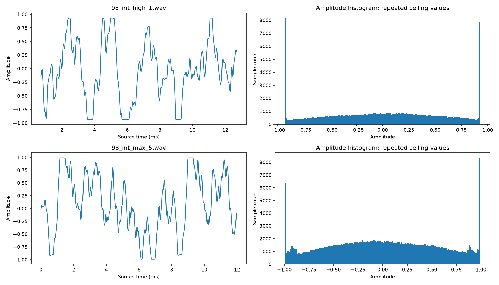
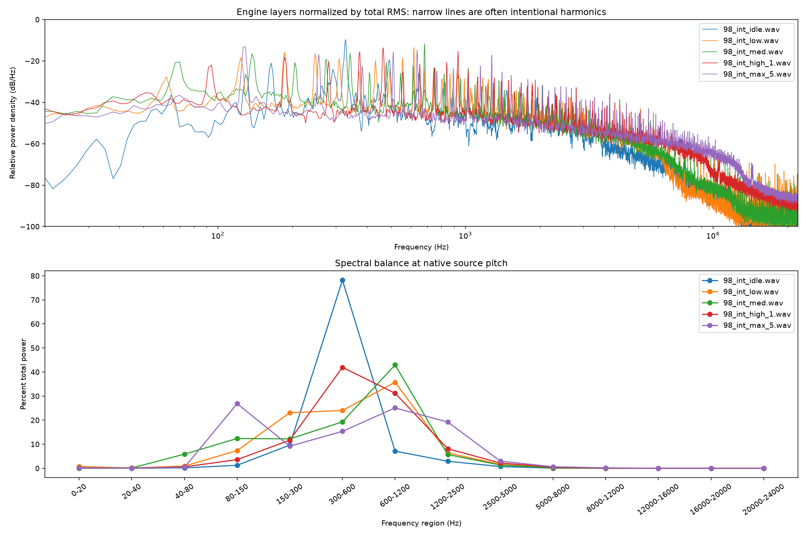

# V10 GP3 source-bank analysis and proposed remaster

Analysis date: 20 September 2026. Scope: all 13 audio files in `D:\Formula90s\game\sounds\banks\v10-gp3`, recursively inventoried. No source audio, sampler configuration, or repository files were modified. No remastered audio was generated.

**The priority is level calibration, DC correction, and loop preparation. The bank does not justify a global mastering preset.** High and maximum have strong evidence of baked clipping/limiting, idle has marked tonal amplitude modulation, and low/medium have unsafe raw loop joins. Broad treble suppression, denoising, pitch correction, harmonic replacement, and additional limiting would risk changing the sound more than the measurements justify.

These are measurement-based engineering recommendations, not an approved listening result. “Harsh,” “unwanted,” and “cleaner” require a level-matched listening comparison. A narrow spectral peak alone is not a defect in an engine recording.

## Provenance and measurement definitions

Repository branch: `main-clean`; HEAD: `ce768b53f5c0a068253b42f7489cd89f93433059`. The checkout was already dirty, including staged source WAV additions and unrelated audio/runtime work. Its initial inventory is recorded in `repository-status-before.txt`; nothing was staged, committed, reset, rebuilt, or run in Godot. Every WAV was hashed before and after analysis. All 13 SHA-256 values are unchanged.

The existing sampler manifest identifies five engine loops and eight one-shot events. All sources are 44,100 Hz, 16-bit PCM. Backfires and limiter are effectively dual mono: channel correlation is at least 0.999997. Engine layers and gear events are mono. Stereo file LUFS therefore reads approximately 3.01 LU higher than an averaged mono playback signal; this is a channel-count effect, not extra engine loudness. Both file LUFS and mono comparisons are provided.

- Peak: maximum absolute decoded sample, across channels. RMS: unweighted root mean square, averaged over samples and channels; 0 dBFS denotes amplitude 1. Crest factor: peak minus RMS.
- Estimated true peak: 8× SciPy polyphase reconstruction, Kaiser beta 12, line extension at edges. This is an oversampled estimate, not a certified BS.1770 true-peak meter. Reported hundredths aid comparison, not a claim of that much absolute accuracy.
- Integrated LUFS: pyloudnorm default K weighting, 400 ms blocks, 75% overlap, standard absolute/relative gates. Files under 400 ms are N/A, without padding or repetition. Values for the other short files remain descriptive, not programme-loudness certification.
- Short-event alternatives: mono whole-clip ungated K-weighted energy and maximum 100 ms K-weighted level. These are **not** standard integrated or momentary LUFS. They are useful within a consistent event family.
- Envelope dynamic range: P95 minus P10 of 20 ms RMS windows, 5 ms hop. Sustained variability: P90 minus P10 of 100 ms RMS, 10 ms hop, central 80% of the file. These are defined local descriptors, **not EBU LRA**. No stable programme LRA is claimed for 0.194–5.054 s assets.
- Spectrum: Welch Hann windows up to 16,384 samples, 50% overlap, no detrending, approximately 2.69 Hz bins for long files. Band shares describe this Welch estimate; for short transients its window weighting differs from whole-file energy. Sub-bass is rechecked after subtracting the mean to separate offset from rumble.
- Pitch: 160 ms windows/20 ms hop; normalized autocorrelation at 12 kHz, plus interpolated tracking of the dominant spectral line within ±4%. Pitch variation is P90–P10 in cents over the central 80%. A tracked harmonic or autocorrelation period is not automatically the physical firing fundamental.
- Noise: minimum/low-percentile envelopes, tails, spectra and spectrograms. There is no isolated noise-only reference. Noise floor and signal-to-noise ratio cannot be separated reliably from combustion texture, tonal modulation, and fades.

Method references: [ITU-R BS.1770](https://www.itu.int/rec/R-REC-BS.1770), [EBU metering and LRA limitations](https://tech.ebu.ch/news/2016/08/ebu-loudness-changes), [pyloudnorm implementation](https://github.com/csteinmetz1/pyloudnorm/blob/master/pyloudnorm/meter.py), [SciPy Welch](https://docs.scipy.org/doc/scipy/reference/generated/scipy.signal.welch.html), and [SciPy polyphase resampling](https://docs.scipy.org/doc/scipy/reference/generated/scipy.signal.resample_poly.html).

Python 3.14.5; libraries: numpy 2.4.6, scipy 1.18.0, soundfile 0.14.0, matplotlib 3.11.1, pyloudnorm 0.2.0. Scripts and machine-readable measurements are included alongside this report.

## 1. Levels, dynamics, DC, and clipping

| File | s / ch | Peak dBFS | Est. TP dBFS | RMS dBFS | File LUFS-I | Crest dB | Envelope DR dB |
| --- | --- | --- | --- | --- | --- | --- | --- |
| 98_int_idle.wav | 2.000 / 1 | -2.46 | -2.46 | -12.27 | -13.03 | 9.81 | 5.60 |
| 98_int_low.wav | 2.500 / 1 | -0.72 | -0.71 | -12.18 | -12.66 | 11.46 | 2.18 |
| 98_int_med.wav | 2.500 / 1 | -0.29 | -0.27 | -10.75 | -11.28 | 10.46 | 2.75 |
| 98_int_high_1.wav | 2.500 / 1 | -0.62 | -0.37 | -4.94 | -5.18 | 4.32 | 1.44 |
| 98_int_max_5.wav | 5.054 / 1 | -0.05 | 0.16 | -5.04 | -5.22 | 4.99 | 2.17 |
| 500_backfire3.wav | 0.651 / 2 | -0.02 | -0.02 | -17.17 | -15.77 | 17.14 | 20.95 |
| 500_backfire4.wav | 0.595 / 2 | -0.09 | -0.09 | -17.34 | -14.97 | 17.25 | 14.39 |
| 500_backfire5.wav | 0.362 / 2 | -0.06 | -0.06 | -16.16 | N/A | 16.11 | 21.55 |
| 500_backfire6.wav | 0.397 / 2 | -0.05 | -0.05 | -16.85 | N/A | 16.80 | 16.84 |
| 500_backfire7.wav | 0.777 / 2 | -6.42 | -6.42 | -19.61 | -17.54 | 13.20 | 13.90 |
| 500_limiter.wav | 0.361 / 2 | -0.26 | -0.24 | -11.29 | N/A | 11.04 | 8.57 |
| geardn.wav | 0.194 / 1 | -3.56 | -3.56 | -13.59 | N/A | 10.03 | 14.32 |
| gearup.wav | 0.296 / 1 | -5.68 | -5.68 | -16.61 | N/A | 10.93 | 14.38 |

All files have **zero digital-rail samples** at −1 or +32767/32768. This does not mean that the sources have never been clipped. The high layer has a repeated ceiling around ±0.931; maximum has many short flat tops around ±0.99. These are below the current encoding rails.

| File | DC signed (% FS, first ch) | DC magnitude dBFS | Samples ≥−0.1 dBFS (%) | ≥−1 dBFS (%) | High-level plateau participation (%) | Longest plateau (samples) |
| --- | --- | --- | --- | --- | --- | --- |
| 98_int_idle.wav | -0.0074 | -82.63 | 0.000 | 0.000 | 0.007 | 2 |
| 98_int_low.wav | 2.0778 | -33.65 | 0.000 | 0.007 | 0.004 | 2 |
| 98_int_med.wav | 0.3957 | -48.05 | 0.000 | 0.033 | 0.018 | 3 |
| 98_int_high_1.wav | 1.1829 | -38.54 | 0.000 | 16.235 | 13.357 | 37 |
| 98_int_max_5.wav | 0.8092 | -41.84 | 5.926 | 13.287 | 5.508 | 24 |
| 500_backfire3.wav | -0.0750 | -62.49 | 0.160 | 0.362 | 0.000 | 0 |
| 500_backfire4.wav | 0.0109 | -79.23 | 0.004 | 0.103 | 0.008 | 2 |
| 500_backfire5.wav | -0.0274 | -71.25 | 0.088 | 0.138 | 0.000 | 0 |
| 500_backfire6.wav | -0.0000 | -131.14 | 0.131 | 0.372 | 0.000 | 0 |
| 500_backfire7.wav | -0.0038 | -88.34 | 0.000 | 0.000 | 0.000 | 0 |
| 500_limiter.wav | -0.0748 | -62.52 | 0.000 | 0.144 | 0.000 | 0 |
| geardn.wav | -0.1495 | -56.50 | 0.000 | 0.000 | 0.000 | 0 |
| gearup.wav | -0.0197 | -74.10 | 0.000 | 0.000 | 0.000 | 0 |

Plateau participation counts samples in exact repeated-value runs with absolute amplitude >0.5, on the mono signal. Isolated 2–3 sample coincidences in other files are not sufficient clipping evidence. In high, 7,596 samples equal −0.931091 and 7,233 equal +0.931061; the longest flat run is 37 samples (0.84 ms). Maximum reaches an estimated +0.16 dBFS reconstructed peak. Its original peaks cannot be recovered by reducing gain or applying EQ. Retain this saturation as part of the baseline character; any de-clipping experiment must be a separate, auditioned variant.

## 2. Low-level content, amplitude stability, and transients

| File | Quietest 20 ms dBFS | Time of quiet window (s) | P10 20 ms dBFS | Final 20 ms dBFS | Central 100 ms variation dB | Peak time ms | 5–95% energy span ms |
| --- | --- | --- | --- | --- | --- | --- | --- |
| 98_int_idle.wav | -19.40 | 1.267 | -15.74 | -11.94 | 4.86 | 801.7 | 1822.1 |
| 98_int_low.wav | -14.08 | 2.240 | -13.12 | -12.80 | 1.52 | 603.5 | 2233.7 |
| 98_int_med.wav | -13.71 | 0.100 | -12.04 | -9.71 | 1.95 | 318.9 | 2217.8 |
| 98_int_high_1.wav | -7.35 | 1.422 | -5.56 | -4.66 | 0.99 | 3.6 | 2230.6 |
| 98_int_max_5.wav | -7.20 | 1.766 | -6.15 | -5.24 | 2.18 | 1895.7 | 4535.5 |
| 500_backfire3.wav | -47.69 | 0.639 | -32.31 | -48.98 | 10.90 | 59.5 | 388.1 |
| 500_backfire4.wav | -42.07 | 0.584 | -27.16 | -42.76 | 6.70 | 155.5 | 402.7 |
| 500_backfire5.wav | -50.39 | 0.349 | -33.10 | -52.15 | 6.87 | 47.8 | 217.0 |
| 500_backfire6.wav | -42.05 | 0.384 | -27.86 | -43.95 | 10.08 | 87.7 | 236.8 |
| 500_backfire7.wav | -42.92 | 0.763 | -28.91 | -46.35 | 5.51 | 423.2 | 491.7 |
| 500_limiter.wav | -17.37 | 0.324 | -16.02 | -15.96 | 4.90 | 82.8 | 280.2 |
| geardn.wav | -31.08 | 0.180 | -23.65 | -31.28 | 1.45 | 96.6 | 126.8 |
| gearup.wav | -37.86 | 0.284 | -28.39 | -38.67 | 3.48 | 41.1 | 206.5 |

The quiet-window figures are **signal-containing levels, not measured noise floors**. Backfire minima occur in the decaying tail. Event variation and energy span describe the intended transient and must not be flattened to the engine-loop target. The limiter is a short active burst, not a quiet recording suitable for a noise profile. Gear-down retains substantial bass energy despite its short duration.

| Event | Mono LUFS-I | Mono ungated K level | Max 100 ms K level | Final 5 ms dBFS |
| --- | --- | --- | --- | --- |
| 500_backfire3.wav | -18.78 | -18.42 | -13.79 | -61.08 |
| 500_backfire4.wav | -17.98 | -18.44 | -15.51 | -51.64 |
| 500_backfire5.wav | N/A | -17.11 | -14.68 | -68.13 |
| 500_backfire6.wav | N/A | -18.01 | -14.34 | -54.69 |
| 500_backfire7.wav | -20.55 | -21.32 | -18.10 | -57.58 |
| 500_limiter.wav | N/A | -11.60 | -9.11 | -16.30 |
| geardn.wav | N/A | -16.16 | -14.40 | -41.12 |
| gearup.wav | N/A | -17.97 | -15.67 | -51.74 |

Idle varies by 4.86 dB in the sustained descriptor; low/medium/high/maximum are approximately 1.52/1.95/0.99/2.18 dB. Idle has two substantial envelope troughs near 0.4 and 1.25 s. Its 300–600 Hz band varies by 6.24 dB while 2.5–5 kHz varies by only 0.79 dB. This points to tonal amplitude modulation rather than a broadband level problem. Leave some idle unevenness intact; aggressive gain riding would raise the steady broadband component during the troughs.

| Loop | 80–150 Hz range dB | 300–600 Hz range dB | 2.5–5 kHz range dB | 8–16 kHz range dB |
| --- | --- | --- | --- | --- |
| 98_int_idle.wav | 4.66 | 6.24 | 0.79 | 0.69 |
| 98_int_low.wav | 9.06 | 1.83 | 1.00 | 0.44 |
| 98_int_med.wav | 9.43 | 3.10 | 1.84 | 2.16 |
| 98_int_high_1.wav | 4.60 | 2.74 | 1.13 | 0.97 |
| 98_int_max_5.wav | 4.85 | 5.31 | 1.78 | 0.80 |

These diagnostic band envelopes use third-order Butterworth bandpasses applied forward/backward, then 100 ms RMS over the central envelope frames. Detector differences mean their thresholds must be recalibrated in the chosen processor. Low and medium show approximately 9 dB modulation in 80–150 Hz despite relatively stable broadband levels; this supports limited band-specific control over a full-band compressor if that movement is audible.

## 3. Spectral balance and harmonic identity

| File | <20 Hz % | 20–80 Hz % | 80–300 Hz % | 300–1200 Hz % | 1.2–5 kHz % | 5–8 kHz % | >8 kHz % | Centroid Hz | 99% rolloff Hz |
| --- | --- | --- | --- | --- | --- | --- | --- | --- | --- |
| 98_int_idle.wav | 0.000 | 0.156 | 10.87 | 85.31 | 3.63 | 0.030 | 0.0024 | 428.9 | 2309.4 |
| 98_int_low.wav | 0.752 | 1.006 | 30.42 | 59.75 | 7.96 | 0.106 | 0.0034 | 588.3 | 2872.0 |
| 98_int_med.wav | 0.082 | 5.988 | 24.58 | 62.24 | 7.00 | 0.104 | 0.0066 | 582.3 | 2802.0 |
| 98_int_high_1.wav | 0.153 | 0.678 | 15.27 | 73.12 | 10.30 | 0.422 | 0.0531 | 729.2 | 3827.5 |
| 98_int_max_5.wav | 0.141 | 0.411 | 36.02 | 40.43 | 22.17 | 0.630 | 0.1903 | 756.7 | 4551.6 |
| 500_backfire3.wav | 0.872 | 16.198 | 51.57 | 30.97 | 0.38 | 0.006 | 0.0005 | 283.5 | 979.8 |
| 500_backfire4.wav | 0.561 | 11.282 | 44.70 | 42.96 | 0.50 | 0.001 | 0.0002 | 338.9 | 1049.7 |
| 500_backfire5.wav | 0.982 | 3.303 | 30.46 | 65.08 | 0.17 | 0.001 | 0.0002 | 393.7 | 966.5 |
| 500_backfire6.wav | 1.008 | 11.598 | 45.70 | 41.24 | 0.45 | 0.002 | 0.0002 | 356.8 | 1014.8 |
| 500_backfire7.wav | 0.120 | 30.656 | 52.63 | 8.34 | 8.25 | 0.001 | 0.0001 | 276.1 | 1738.8 |
| 500_limiter.wav | 0.000 | 1.962 | 55.69 | 27.15 | 15.09 | 0.080 | 0.0314 | 620.2 | 2902.4 |
| geardn.wav | 0.083 | 51.751 | 46.70 | 1.44 | 0.03 | 0.000 | 0.0000 | 103.1 | 325.1 |
| gearup.wav | 0.612 | 14.858 | 63.23 | 20.76 | 0.55 | 0.001 | 0.0001 | 223.2 | 895.0 |

Low’s apparent <20 Hz share falls from 0.752% to 0.043% after mean removal: most is DC, not rumble. Corresponding residual <20 Hz shares are idle 0.00013%, medium 0.061%, high 0.116%, maximum 0.118%. There is no justification for a common 80–100 Hz high-pass filter: it would remove real low-order engine harmonics and much of the gear-event impact.

| File | Six strongest resolved peaks, Hz |
| --- | --- |
| 98_int_idle.wav | 328.4, 492.6, 164.2, 290.7, 648.7, 129.2 |
| 98_int_low.wav | 619.1, 185.7, 247.6, 123.8, 557.2, 309.5 |
| 98_int_med.wav | 683.7, 137.3, 341.8, 274.5, 70.0, 479.1 |
| 98_int_high_1.wav | 465.7, 934.0, 374.1, 185.7, 279.9, 839.8 |
| 98_int_max_5.wav | 126.5, 637.9, 511.4, 255.7, 1275.8, 1149.3 |
| 500_backfire3.wav | 126.5, 32.3, 72.7, 261.1, 107.7, 188.4 |
| 500_backfire4.wav | 134.6, 290.7, 75.4, 156.1, 417.2, 185.7 |
| 500_backfire5.wav | 154.6, 563.3, 309.3, 325.8, 463.9, 441.8 |
| 500_backfire6.wav | 145.3, 48.4, 64.6, 94.2, 288.0, 314.9 |
| 500_backfire7.wav | 45.8, 156.1, 118.4, 175.0, 236.9, 277.2 |
| 500_limiter.wav | 226.9, 727.7, 666.8, 60.9, 929.6, 1117.8 |
| geardn.wav | 51.6, 82.6, 180.6, 221.9, 31.0, 299.3 |
| gearup.wav | 47.3, 128.3, 182.4, 97.9, 273.6, 304.0 |

One-shot peaks describe transient resonances, not stable fundamentals. Pitch stability is not a meaningful pass/fail requirement for backfires, limiter interruption or gear thumps. For these events, preserve the measured attack and decay; no pitch correction is indicated.

| Loop | Candidate harmonic spacing Hz | Autocorrelation period Hz / confidence | Tracked line Hz | Line P90–P10 cents | Line drift cents/s |
| --- | --- | --- | --- | --- | --- |
| 98_int_idle.wav | 32.75 | 162.93 / 0.83 | 327.68 | 13.40 | 0.76 |
| 98_int_low.wav | 61.86 | 61.85 / 0.78 | 618.63 | 2.95 | -0.21 |
| 98_int_med.wav | 68.35 | 68.37 / 0.79 | 683.54 | 3.98 | 2.02 |
| 98_int_high_1.wav | 93.15 | 93.26 / 0.84 | 464.65 | 11.55 | -0.10 |
| 98_int_max_5.wav | 127.75 | 127.68 / 0.89 | 127.77 | 7.40 | 0.20 |

The approximately 32.75/61.86/68.35/93.15/127.75 Hz families progress upward, but these are acoustic periodicities, not independently measured crankshaft speed. Idle strongly favors the fifth/tenth family members near 164/328 Hz; autocorrelation therefore selects approximately 163 Hz instead of 32.75 Hz. Low and medium favor their tenth member near 619/684 Hz; high favors approximately the fifth near 466 Hz; maximum emphasizes the first near 128 Hz. This change of harmonic dominance is a large part of the bank’s identity. Do not make every layer’s spectrum identical or infer RPM from its loudest peak.

The candidate spacing is a diagnostic fit to the resolved harmonic family, with individual deviations recorded in `diagnostic_details.json`; weak/inharmonic lines and time variation prevent a unique physical-fundamental claim. The existing manifest’s comb calibration is context, not ground truth. Its own stored confidence values are low. No sample-rate or pitch rewrite is warranted from this analysis alone. Preserve slow natural modulation, and evaluate any beats at actual transition playback rates before changing reference anchors.

Above 8 kHz, even maximum carries only about 0.19% of Welch power; high carries about 0.053%. The original upper-RPM distortion produces harmonic extension that may contribute aggression. The spectra do not establish objectionable aliasing. A static recording cannot reliably distinguish aliased products from intentional harmonics or recording artifacts without a source reference or playback-rate experiment. Narrow high-frequency peaks are retained as diagnostic candidates in JSON, not automatically labeled whistles to remove.

## 4. Adjacent RPM-layer comparisons

Each raw source was analytically resampled to the existing manifest’s transition-center RPM, then trimmed by 50 ms at each edge before measurement. Resampling was band-limited FFT interpolation in memory; no audio was saved. These are source-to-source comparisons, not validation of the prepared runtime loops, filters, envelopes, or mixer. Existing calibrated gains were excluded so that source inconsistencies remain visible.

| Transition | Center RPM | Playback rates A / B | B−A LU | B−A RMS dB | Existing relative gain B/A dB |
| --- | --- | --- | --- | --- | --- |
| 98_int_idle.wav → 98_int_low.wav | 6266 | 1.379 / 0.725 | -0.02 | 0.14 | 0.75 |
| 98_int_low.wav → 98_int_med.wav | 9091 | 1.052 / 0.951 | 1.28 | 1.40 | 0.58 |
| 98_int_med.wav → 98_int_high_1.wav | 11164 | 1.167 / 0.857 | 5.73 | 5.82 | -4.47 |
| 98_int_high_1.wav → 98_int_max_5.wav | 15245 | 1.170 / 0.855 | -0.49 | -0.11 | 1.36 |

| Transition | 80–150 Hz ΔdB | 150–300 Hz ΔdB | 300–600 Hz ΔdB | 600–1200 Hz ΔdB | 1.2–2.5 kHz ΔdB | 2.5–5 kHz ΔdB |
| --- | --- | --- | --- | --- | --- | --- |
| 98_int_idle.wav → 98_int_low.wav | 21.45 | 5.83 | -2.21 | -0.67 | 1.88 | -4.62 |
| 98_int_low.wav → 98_int_med.wav | 2.68 | -2.76 | 0.02 | 0.80 | -1.34 | -1.61 |
| 98_int_med.wav → 98_int_high_1.wav | -3.30 | -1.62 | 2.90 | -1.51 | 0.02 | -0.51 |
| 98_int_high_1.wav → 98_int_max_5.wav | 8.67 | 1.30 | -0.85 | -1.48 | -0.61 | -1.20 |

Band differences above are **after compensating each pair’s LUFS difference**, at the common RPM. They are diagnostic contrasts, not required EQ gains. Large ratios against an almost absent band, especially idle’s low-order energy, do not justify equally large boosts/cuts.

- Idle → low: overall loudness already matches closely at the boundary, but low adds bass/low-order harmonics and loses upper content. This harmonic-envelope transition is more important than the native-pitch loudness difference. Do not boost idle’s missing bass by 21 dB.
- Low → medium: about +1.28 LU before calibration; modest level adjustment may suffice, with conservative control of the moving 124/137 Hz components if needed.
- Medium → high: about +5.73 LU before calibration. Correct gain first. The residual +2.90 dB in 300–600 Hz supports a small optional cut around high’s 466 Hz source harmonic, not a broadband treble cut.
- High → maximum: approximately −0.49 LU overall, yet maximum adds +8.67 dB in the 80–150 Hz boundary band. Its strong 128 Hz source component should be retained, with at most shallow dynamic control if it makes the handoff boomy.

The existing manifest already attenuates high relative to medium by 4.47 dB, and encodes a designed 1.5 dB transition-level progression. Do not add the proposed source trims on top of old calibration without recomputing that calibration. Matching source storage levels and preserving the runtime RPM loudness curve are separate tasks.

Across 32 circular relative offsets per pair, equal-RMS equal-power midpoint estimates vary by roughly −0.64 to +0.60 dB. These whole-overlap estimates do not bound short-time comb filtering, beating, or peak overshoot. Both level and phase behavior must be measured through the actual runtime crossfade at its start, center and end. Keep additional bus headroom for correlated overlap and event voices.

## 5. Raw loop boundaries

| Loop | End→start jump dBFS | Jump / internal P99 step | Tail−head 20 ms level dB | 20 ms tail/head correlation |
| --- | --- | --- | --- | --- |
| 98_int_idle.wav | -30.53 | 0.62 | -0.03 | -0.693 |
| 98_int_low.wav | -12.78 | 3.23 | 0.10 | 0.088 |
| 98_int_med.wav | -1.76 | 9.57 | 0.76 | 0.111 |
| 98_int_high_1.wav | -28.77 | 0.17 | 0.57 | 0.443 |
| 98_int_max_5.wav | -26.59 | 0.19 | -0.05 | -0.405 |

There are no embedded `smpl` loop markers in the source WAVs. These figures test the full-file raw join, not the loops prepared by the existing build script. Medium’s 0.816 FS jump is 9.57 times its internal P99 adjacent-sample difference; low’s 0.230 FS jump is 3.23 times. They need deliberate loop construction. High/maximum have smaller endpoint jumps, but opposite-phase or mismatched waveform neighborhoods can still create a spectral seam. Idle and maximum have negative 20 ms edge correlations, so a blind overlap can create a dip.

For a future derivative, search start/end windows for similar waveform phase, slope, local RMS, and harmonic spectrum after DC correction. Evaluate 10–30 ms overlaps as an initial search range, extending only if necessary for the low-order period. This range covers roughly one or more prominent cycles without a long amplitude fade; it is not a guaranteed recipe. Pick the overlap law from correlation: linear weights suit coherent aligned material, equal-power weights suit decorrelated material. Check the interior splice as well as the final wrap. Preserve as much stable material and natural modulation as possible. Require no visible exceptional derivative jump, ≤0.5 dB local envelope disturbance as an engineering target, and no click or periodic dip in repeated listening. Smaller endpoint numbers alone do not certify a seamless loop.

The eight events are not loops. Backfires and gear-up reach zero endpoints; gear-down starts near −62 dBFS and ends at zero. Preserve their tails. The limiter ends at +0.07431 FS (approximately −22.6 dBFS), so an immediate stop to silence creates a real endpoint step. In a future derivative, trial a 3–5 ms fade to zero at its tail, then verify that the final burst is retained; this is an edge repair, not compression of its interior bursts.

## 6. Proposed EQ and filtering: source-rate settings

All values below are conservative starting points for a later non-destructive pass, not measured optimal settings. EQ frequencies refer to native 44.1 kHz source playback; they move with playback rate. “Conditional” means the default is bypass until a matched comparison confirms the measured feature is objectionable. There is **no justified reinforcement**: all boost gains start at 0 dB. Retain low-order body, 300–1200 Hz harmonic structure, and the original upper-RPM rasp.

| Source | Recommendation (Hz, Q, dB) | Measured justification / preserve |
| --- | --- | --- |
| 98_int_idle.wav | Static EQ bypass. Conditional dynamic bell 328 Hz, Q 1.5, 0 to −1.5 dB. | 300–600 Hz carries 78.20% of power and varies 6.24 dB. Reduce only excess peaks; preserve the main 164/328/493 Hz family and idle unevenness. |
| 98_int_low.wav | Remove +2.078% DC. Conditional dynamic bell 124 Hz, Q 2.0, 0 to −1.5 dB. | 80–150 Hz envelope varies 9.06 dB. Preserve approximately 62/186/248/619 Hz; avoid weakening the entire bass range. |
| 98_int_med.wav | Remove +0.396% DC. Conditional dynamic bell 137 Hz, Q 2.0, 0 to −1.5 dB. | 80–150 Hz envelope varies 9.43 dB. Preserve 68/342/684 Hz character; fix the loop seam first. |
| 98_int_high_1.wav | Remove +1.183% DC and calibrate level first. Conditional bell 466 Hz, Q 1.2, −1.0 dB; do not exceed −1.5 dB initially. | At aligned medium→high transition, 300–600 Hz is +2.90 dB after loudness matching. Prefer dynamic 0 to −1 dB if only local peaks offend. Preserve baked saturation and approximately 934 Hz. |
| 98_int_max_5.wav | Remove +0.809% DC and calibrate level first. Conditional dynamic bell 128 Hz, Q 2.0, 0 to −1.5 dB. | 80–150 Hz carries 26.85% of power, varies 4.85 dB, and increases +8.67 dB at the boundary. Preserve the fundamental rather than fully equalizing this difference. |
| 500_backfire3.wav | EQ bypass. Optional high-pass 20 Hz, Q 0.707, 12 dB/oct if subsonic excursion matters. | 6.77% below 40 Hz, including a 32 Hz component. Preserve 73/127 Hz impact and 300–1200 Hz burst texture. |
| 500_backfire4.wav | EQ bypass. Optional high-pass 20 Hz, Q 0.707, 12 dB/oct. | 2.89% below 40 Hz; preserve the 135/291 Hz body. No measured need for a resonant notch. |
| 500_backfire5.wav | EQ bypass. Optional high-pass 20 Hz, Q 0.707, 12 dB/oct. | 1.93% below 40 Hz; 300–600 Hz is naturally dominant. Preserve 155/309/563 Hz and transient crest. |
| 500_backfire6.wav | EQ bypass. Optional high-pass 20 Hz, Q 0.707, 12 dB/oct. | 3.94% below 40 Hz; preserve 145 Hz thump and 600–1200 Hz crack. |
| 500_backfire7.wav | EQ bypass; no automatic bass cut. High-pass normally bypassed. | 29.27% in 40–80 Hz and a 46 Hz dominant peak are part of its distinct event body. This variant already has headroom. |
| 500_limiter.wav | EQ bypass; any high-pass trial limited to 20 Hz, Q 0.707, 12 dB/oct. | Preserve interruption rhythm and burst structure; treat as an event, not a smooth sustained loop. |
| geardn.wav | EQ and filters bypass by default. | 50.82% of Welch power lies in 40–80 Hz, with a 52 Hz peak. A conventional 80 Hz cleanup filter would remove the event itself. |
| gearup.wav | EQ and filters bypass by default. | Distinct 47/128/182 Hz impact with already negligible treble; no evidence supporting a brightness boost. |

For loops, remove a constant mean before deciding whether any high-pass is useful. If residual low-frequency drift remains problematic, trial **20 Hz, Q 0.707, 12 dB/oct** only on low/medium/high/maximum. The ideal second-order response at 62 Hz is approximately −0.05 dB, so this is deliberately below their measured family spacing. Idle needs no high-pass: it has almost no sub-20 Hz energy and the weakest inferred 33 Hz family deserves protection. In a one-shot, blindly subtracting its whole-file mean can create nonzero tails; use padded filtering and inspect endpoints if correction is needed.

**Low-pass recommendation: bypass for every file initially.** There is no measured blanket hiss problem. If listening confirms objectionable upper noise specifically in high/maximum, compare a gentle **12,000 Hz low-pass, Q 0.707, 12 dB/oct**, or an **8,000 Hz high shelf, Q 0.707, −1 dB maximum** as separate alternatives; retain only one if it improves the result without dulling the V10. These are conditional trials justified by their relatively greater upper content, not mandatory processing. Do not apply them to all files or attempt to “repair aliasing” by assumption. Runtime anti-alias filtering for playback above unity is a separate resampling requirement and must be checked at the maximum actual playback rate.

## 7. Compression, dynamic EQ, and noise reduction

Default broadband compression is bypass, including all eight events and the already flattened high/maximum layers. Low and medium have under 2 dB sustained broadband variation; there is no justification for a global compressor. Do not normalize crest factor across the bank: that would flatten low/medium to resemble previously saturated sources.

| Use case | Threshold / detector | Ratio | Attack / release | Makeup | Reduction limit / condition |
| --- | --- | --- | --- | --- | --- |
| Optional idle full-band alternative | −12 dBFS, approximately 100 ms RMS detector, source before normalization; soft knee 3 dB | 1.4:1 | 40 / 180 ms | 0 dB | ≤1.5 dB reduction; compare against tonal dynamic EQ, do not stack both. Chosen around its upper sustained envelope; leave troughs alone. |
| Idle dynamic bell at 328 Hz | About −13.6 dBFS in a 300–600 Hz RMS detector (measured P75) | 1.5:1 | 40 / 180 ms | 0 dB | 0 to −1.5 dB; do not use an upward expander to fill the troughs. |
| Low dynamic bell at 124 Hz | About −21.6 dBFS in an 80–150 Hz RMS detector (P75) | 1.5:1 | 30 / 120 ms | 0 dB | 0 to −1.5 dB, conditional on audible bass fluctuation. |
| Medium dynamic bell at 137 Hz | About −19.4 dBFS in an 80–150 Hz RMS detector (P75) | 1.5:1 | 30 / 120 ms | 0 dB | 0 to −1.5 dB, conditional on audible bass fluctuation. |
| High dynamic alternative at 466 Hz | About −8.1 dBFS in a 300–600 Hz RMS detector (P75) | 1.3:1 | 40 / 160 ms | 0 dB | 0 to −1 dB; use instead of the static bell. No full-band compression. |
| Maximum dynamic bell at 128 Hz | About −10.3 dBFS in an 80–150 Hz RMS detector (P75) | 1.5:1 | 30 / 150 ms | 0 dB | 0 to −1.5 dB. Prefer slower ≤1 dB subtractive gain automation for a global rise. |
| Backfires, limiter, gear events | Bypass / threshold inactive | 1:1 | Inactive | 0 dB | Use gain trim for headroom. Crest and decay are meaningful event characteristics. |

Thresholds refer to source levels after DC correction, before final gain matching. They are not transferable unchanged after a trim: add the trim in dB to the threshold, and recalibrate against the processor’s detector. The detector bands above are wider diagnostic bands, distinct from the bell bandwidth. If a processor cannot use such an external detector, set the threshold from its own P75 measurement. Attack/release starting points are several tonal cycles long and target measured 0.1–0.4 s envelope movement rather than individual combustion pulses. No compression settings here have been auditioned or optimized.

**Prefer dynamic EQ to multiband compression** for the isolated 124/137/128 Hz movements or idle’s dominant tonal band. Dynamic EQ limits the amount of harmonic change and avoids splitting the full signal into multiple crossover bands. Multiband compression is not presently justified: no independent broad-band imbalance requires it. Global de-essing, excitation, saturation, stereo widening and transient sharpening are also unsupported.

**Noise reduction: bypass.** The low-level tails contain wanted decay, and the sustained files contain no independently identifiable silence. Do not train a denoiser on an idle trough or backfire tail, hard-gate the engine loops, or use spectral subtraction simply because the spectrogram has a broadband floor. A future confirmed fixed whistle could receive a narrow dynamic notch (center and Q measured from that line’s bandwidth), but the present evidence does not justify specifying or applying one. Baked nonlinear distortion cannot be reliably removed as “noise.”

## 8. Level targets and gain proposals

For loop derivatives, a provisional common native-pitch storage target is **−16 LUFS-I mono**, with estimated true peak **≤−4 dBFS** and no mandatory limiter. This target is derived from the existing crest/headroom: low is the limiting layer, requiring approximately −15.94 LUFS or lower to leave 4 dB reconstructed-peak headroom. Rounded down, −16 LUFS achieves that for all five by gain alone. This is an asset-calibration reference, not a final playback or broadcast target. Recompute after EQ, any dynamics, and final loop construction.

| Loop | Native mono LUFS-I | Initial gain to −16 LUFS, dB | Predicted estimated TP after gain, dBFS |
| --- | --- | --- | --- |
| 98_int_idle.wav | -13.03 | -2.97 | -5.43 |
| 98_int_low.wav | -12.66 | -3.34 | -4.06 |
| 98_int_med.wav | -11.28 | -4.72 | -4.99 |
| 98_int_high_1.wav | -5.18 | -10.82 | -11.18 |
| 98_int_max_5.wav | -5.22 | -10.78 | -10.62 |

These are gain-only predictions, not processed-file results. At runtime, recalibrate adjacent layers at common RPM with the selected pitch shifter, seam, source trim and existing loudness progression. Aim for ≤0.5 LU unintended handoff error after accounting for the designed gain curve. Maintain source headroom; verify the bus under worst-case loop overlap and event concurrency, with a proposed final output ceiling of −1 dBTP. Do not solve a source mismatch by continually driving a bus limiter.

For event assets, use an **attenuation-only estimated peak ceiling of −3 dBFS**, preserving existing quieter variants. Do not normalize every event upward to the same peak or force all events to engine LUFS. The following gain-only trims bring backfire whole-clip mono K levels to approximately −21.4 to −20.1, already a relatively narrow range without compression.

| Event | Proposed initial trim dB | Predicted est. TP dBFS | Predicted mono ungated K level |
| --- | --- | --- | --- |
| 500_backfire3.wav | -2.98 | -3.00 | -21.40 |
| 500_backfire4.wav | -2.91 | -3.00 | -21.35 |
| 500_backfire5.wav | -2.94 | -3.00 | -20.06 |
| 500_backfire6.wav | -2.95 | -3.00 | -20.96 |
| 500_backfire7.wav | 0.00 | -6.42 | -21.32 |
| 500_limiter.wav | -2.76 | -3.00 | -14.36 |
| geardn.wav | 0.00 | -3.56 | -16.16 |
| gearup.wav | 0.00 | -5.68 | -17.97 |

Backfire 7 keeps its existing gain: raising it to the others’ near-zero raw peaks would overemphasize its dense bass. Preserve the distinct limiter/upshift/downshift mix roles and set event-to-engine balance in context. The −3 dBFS ceiling is an initial per-voice headroom choice, not proof that overlapping events cannot clip the final bus.

## 9. Non-destructive remaster chain and validation gates

1. Freeze this source inventory and preserve original WAV bytes and metadata. Write every future derivative and recipe to a separate versioned bank. Use float processing; choose mono derivatives only after preserving the demonstrated dual-mono behavior.
2. Apply constant DC correction to sustained loops. For events, avoid introducing endpoint steps; only filter demonstrated offset/rumble with boundary padding and inspect the tails.
3. Apply only accepted, sample-specific EQ. Start with all optional filters and boosts bypassed. Level-match listening before calling a change an improvement.
4. If required, use the shallow dynamic EQ controls above. Preserve attacks, idle movement, low-order harmonics and the saturated high-RPM character. No global compressor, denoiser or de-clip pass.
5. Construct and validate final engine loops after processing, using matched phase/slope/envelope windows. Warm up stateful processors on repeated material or handle their filter/envelope state circularly so an artificial start-up transient is not baked into a loop. Check all internal edits, wraps and repeated cycles. Do not loop the events.
6. Re-measure native LUFS/peaks, apply the measured gain trims, then remeasure at actual RPM transition rates and recalculate runtime gains. Retain the authored RPM progression and event roles. Avoid cumulative old/new gain compensation.
7. Quantize once at export; if keeping PCM16, use appropriate dither only at that final conversion. Retain a float intermediate. Confirm derivative clipping, DC, spectra, harmonic spacing, duration, seam and source hashes; no arbitrary peak limiting to reach loudness targets.
8. Validate actual runtime crossfades, fast and slow RPM sweeps, limiter entry, shifts, lift/backfire triggers, anti-alias behavior at the largest playback multiplier, and worst-case simultaneous voices. Compare at matched perceived loudness. A human listening gate must confirm the same V10 identity and improved continuity before any source replacement or runtime promotion.

Priority order: (1) gain/DC and low/medium loop seams, (2) high/maximum baked saturation handled conservatively, (3) idle tonal-envelope control if needed, (4) bass-band handoffs, (5) optional upper-band cleanup only if listening confirms a problem. No claim is made that an analysis-only report has completed these future processing or listening gates.

## 10. Per-file diagnostic plots and reproducibility

- [98_int_idle.wav: waveform, envelope, spectrum, spectrogram, boundary and pitch/transient plot](figures/98_int_idle.png)

- [98_int_low.wav: waveform, envelope, spectrum, spectrogram, boundary and pitch/transient plot](figures/98_int_low.png)

- [98_int_med.wav: waveform, envelope, spectrum, spectrogram, boundary and pitch/transient plot](figures/98_int_med.png)

- [98_int_high_1.wav: waveform, envelope, spectrum, spectrogram, boundary and pitch/transient plot](figures/98_int_high_1.png)

- [98_int_max_5.wav: waveform, envelope, spectrum, spectrogram, boundary and pitch/transient plot](figures/98_int_max_5.png)

- [500_backfire3.wav: waveform, envelope, spectrum, spectrogram, boundary and pitch/transient plot](figures/500_backfire3.png)

- [500_backfire4.wav: waveform, envelope, spectrum, spectrogram, boundary and pitch/transient plot](figures/500_backfire4.png)

- [500_backfire5.wav: waveform, envelope, spectrum, spectrogram, boundary and pitch/transient plot](figures/500_backfire5.png)

- [500_backfire6.wav: waveform, envelope, spectrum, spectrogram, boundary and pitch/transient plot](figures/500_backfire6.png)

- [500_backfire7.wav: waveform, envelope, spectrum, spectrogram, boundary and pitch/transient plot](figures/500_backfire7.png)

- [500_limiter.wav: waveform, envelope, spectrum, spectrogram, boundary and pitch/transient plot](figures/500_limiter.png)

- [geardn.wav: waveform, envelope, spectrum, spectrogram, boundary and pitch/transient plot](figures/geardn.png)

- [gearup.wav: waveform, envelope, spectrum, spectrogram, boundary and pitch/transient plot](figures/gearup.png)

Measurements: [full structured JSON](measurements.json), [scalar CSV](measurements.csv), [diagnostic detail JSON](diagnostic_details.json). Reproduce using `analyze_source_audio.py`, then `analyze_diagnostic_details.py`, then `write_technical_report.py`. Package versions are recorded above. The analysis scripts read WAVs and create numeric/visual artifacts only; they contain no audio-export operation.

| File | SHA-256, unchanged |
| --- | --- |
| 98_int_idle.wav | f0021afba4048c59ae237325c932abef76433f03c437794d73de0e417384ddea |
| 98_int_low.wav | 2eac0ef746c818ecac50fe77ca0099894f4762d55428a3cddfeb3007a6092cc5 |
| 98_int_med.wav | d1a527d5ddf3ec6d4f38127d1c6a3b00d7b7771d5473f68315e4352c98db4007 |
| 98_int_high_1.wav | fc68bc279e3f8098be009be24eb4249c4ab76ab805e595af7bc5c509b1413477 |
| 98_int_max_5.wav | f6b6cd4389fee32cb5f4b41a550e7aa146d4a5d0912fda86551dabfd598aa50b |
| 500_backfire3.wav | e107717d2fe4f4fccd5d10d910b7cff71cd36d11403ef2a1277d36418986d044 |
| 500_backfire4.wav | e903a055cf8b5ca6a79b44862681f12bca5a11e95878f091095d613e7b63171e |
| 500_backfire5.wav | a471a47bc8094a38e50894713b47b7847d81e1c518830b804e25dc87a69ceec1 |
| 500_backfire6.wav | 6179b1460c81f58ce6ed69dd48498e0efcb3ec66eb18054cf1d97ac444426797 |
| 500_backfire7.wav | ed324b6935950738a6cb4eb0ba99eab74b58bd24fe8b6a9dc75973b47269c42c |
| 500_limiter.wav | 1bdb7a2cc3eb6d95e7fa8d56bec55fd4df8c9b307902056b93f5c30b32751758 |
| geardn.wav | 421a7136b22b1624fda39fe9c0540de73b8a9b8c170e328bc44c4db44e09ee3e |
| gearup.wav | f656d22c4b161d16e70bda277066246b99e73d83d0dd5833fa5c2d63ae9d0657 |
